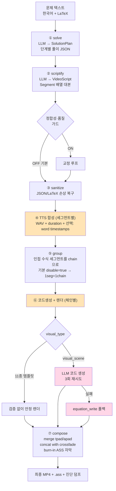
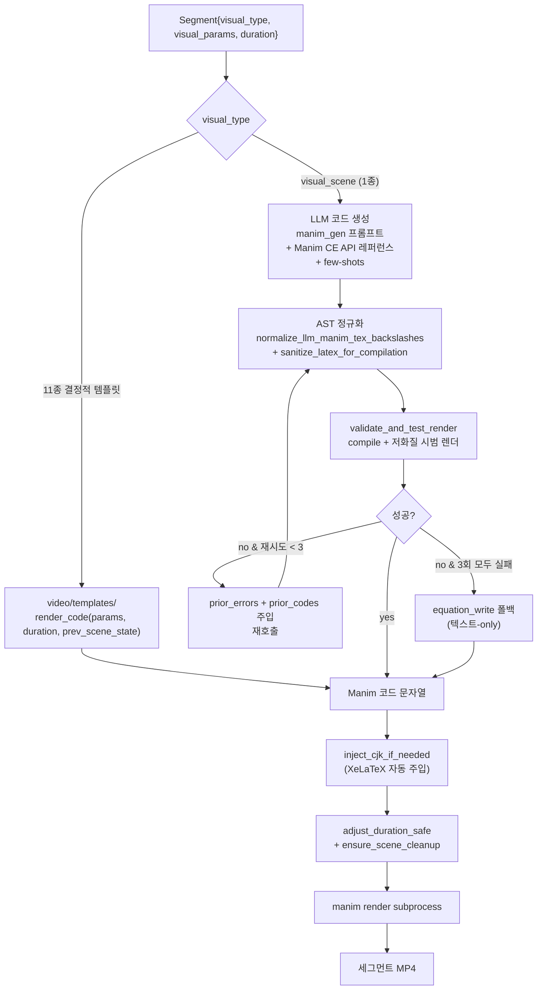
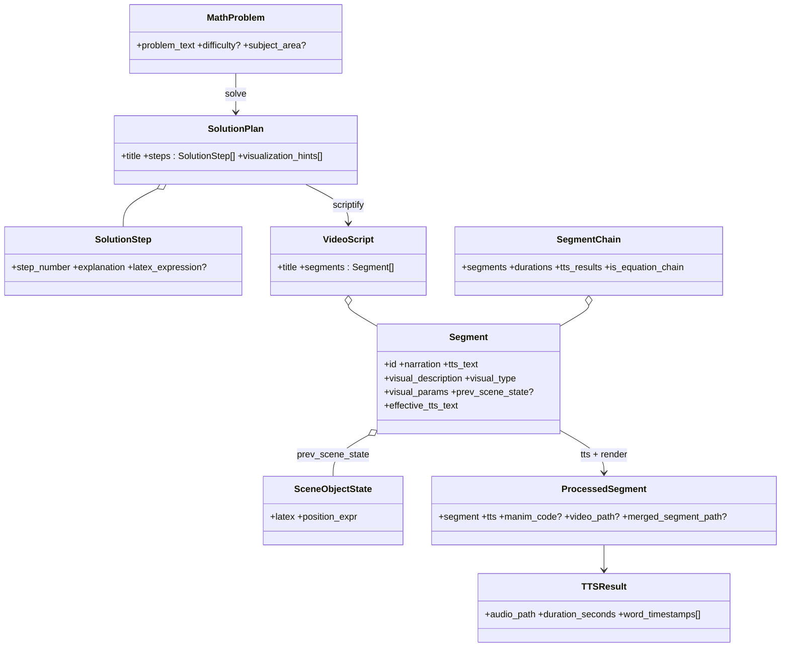
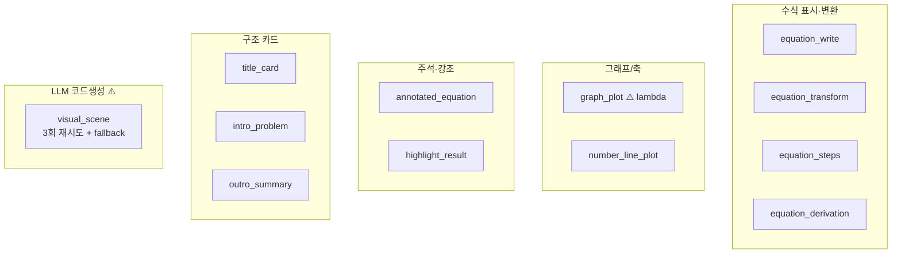
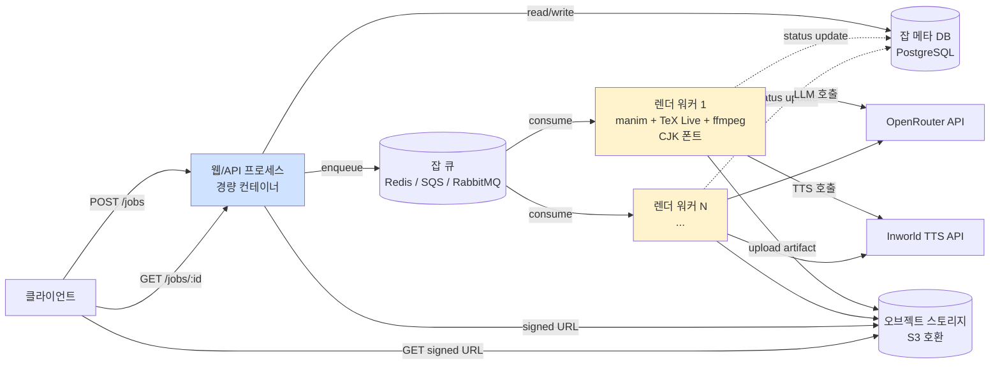
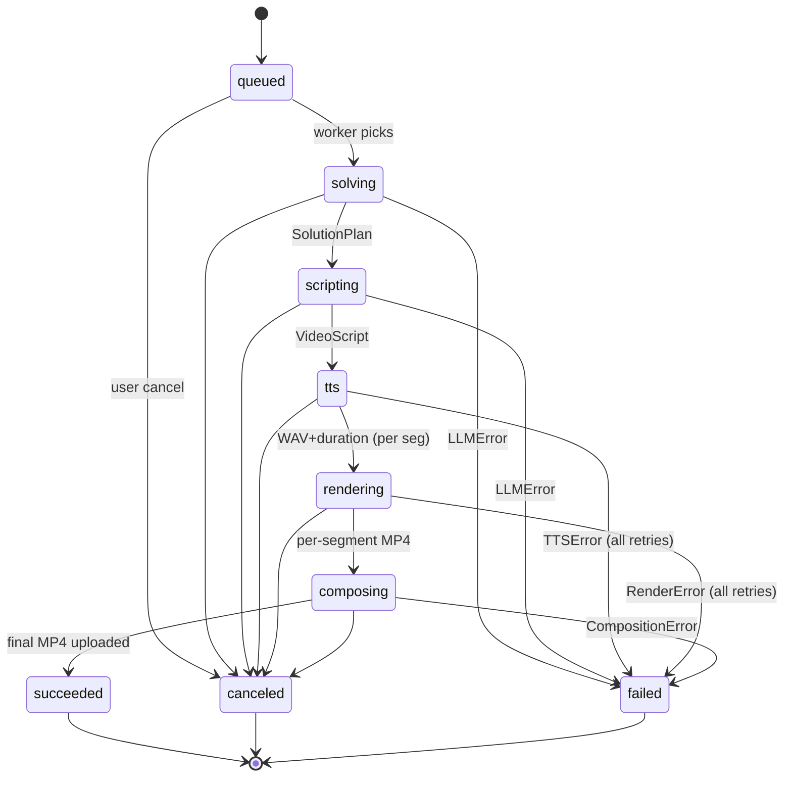
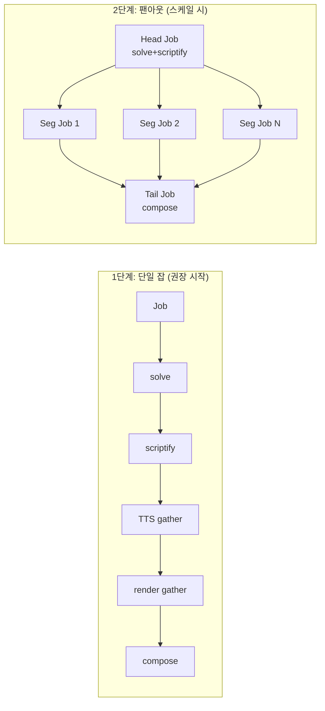
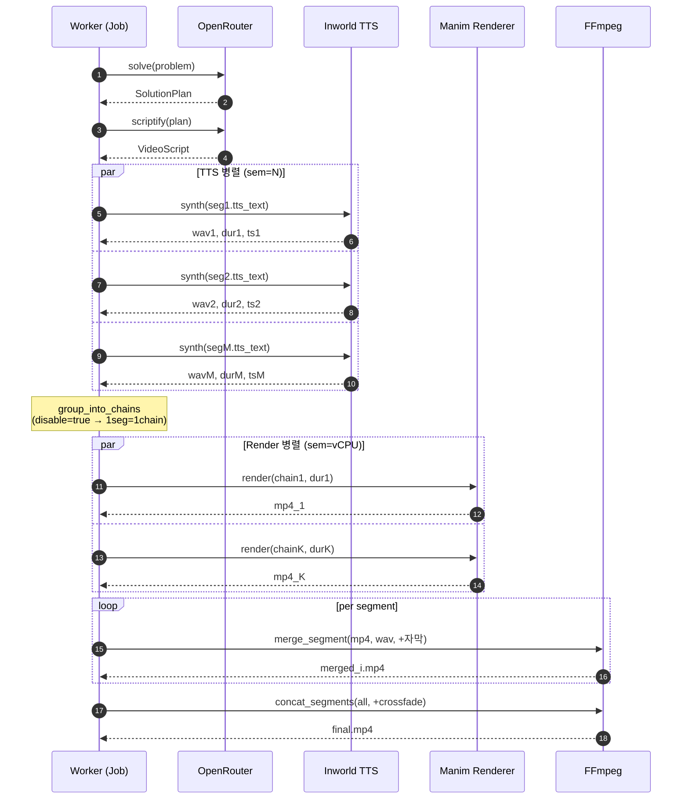
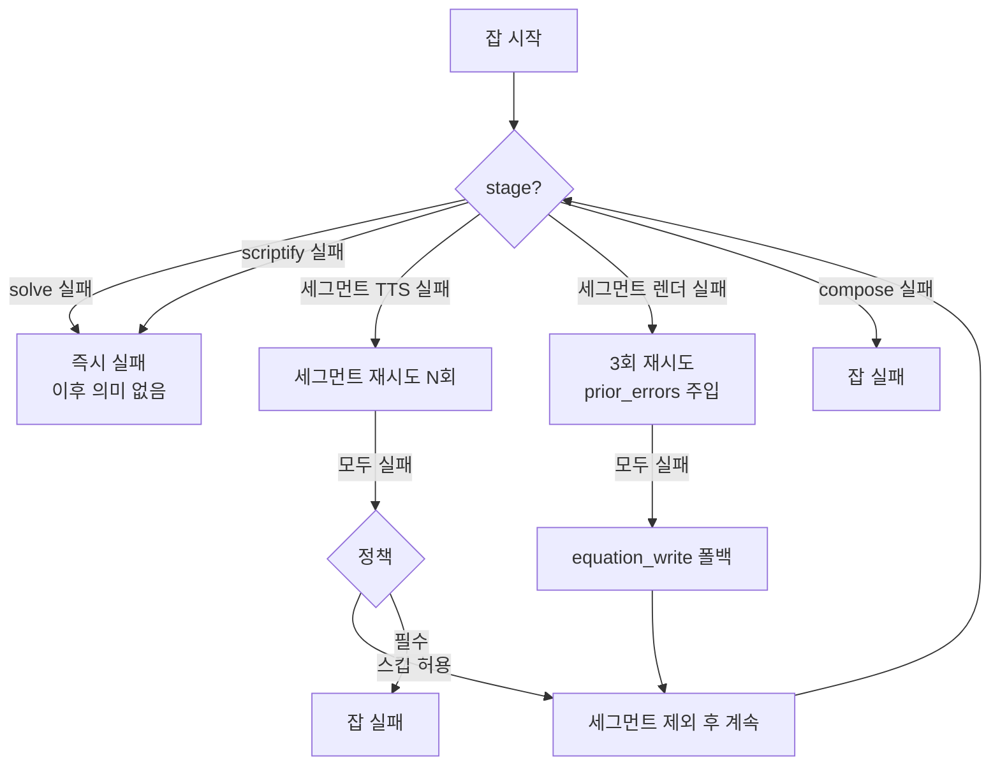
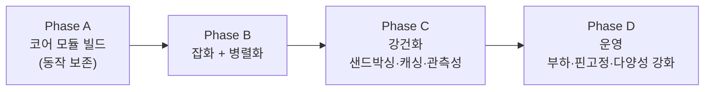

# 해설 동영상 생성 — 서비스 구현 문서

> **이 문서의 목적**
> 수능 수학 해설 동영상 자동 생성 기능을 **새 서비스 레포에서 0부터 다시 만들기 위한 가이드**.
> PoC(`manim-video-gen`) 코드를 그대로 옮기는 게 아니라, **검증된 핵심 로직·정책·프롬프트를 본문 안에 직접 인용**하고, 어디서 안 풀렸는지(post-mortem)와 어떻게 풀어야 하는지(설계 결정·코드)를 같이 담는다.
>
> **결정사항 요약 (이미 합의된 부분)**
> - 통합 형태: Python 백엔드에 모듈 형태로 이식.
> - 실행 모델: 비동기 잡 큐 + 잡 상태 추적.
> - TTS provider: **Inworld TTS**.
> - 기본 timing 정책: TTS-first + 양방향 적응 (5장).
> - 템플릿 전략: 풍부화 + 점진적 LLM 슬롯 도입 (6장).

---

## 목차

- [0. 핵심 요약 — 6가지](#0-핵심-요약--6가지)
- [1. 시스템 한눈에 보기](#1-시스템-한눈에-보기)
- [2. 핵심 설계 결정 5가지](#2-핵심-설계-결정-5가지)
- [3. 데이터 모델](#3-데이터-모델)
- [4. 단계별 핵심 로직](#4-단계별-핵심-로직)
- [5. TTS-first 타이밍 — 양방향 적응](#5-tts-first-타이밍--양방향-적응)
- [6. 비주얼 템플릿 전략 — 풍부화](#6-비주얼-템플릿-전략--풍부화)
- [7. Inworld TTS 깊이 활용](#7-inworld-tts-깊이-활용)
- [8. 서비스 아키텍처](#8-서비스-아키텍처)
- [9. 프로덕션 갭과 대응](#9-프로덕션-갭과-대응)
- [10. 함정 모음 (post-mortem 압축)](#10-함정-모음-post-mortem-압축)
- [11. 단계별 구현 순서](#11-단계별-구현-순서)
- [12. 부록 — 환경변수·의존성·용어집](#12-부록--환경변수의존성용어집)

---

## 0. 핵심 요약 — 6가지

새로 합류하는 엔지니어가 30초 안에 흡수해야 할 핵심.

1. **파이프라인은 7단계 직렬**: 풀이 → 대본 → 손상복구 → TTS → 그룹핑 → 코드생성/렌더 → 합성. 단, **④TTS와 ⑥렌더는 세그먼트 단위 독립**이라 병렬화 가능.
2. **TTS-first**: 음성을 먼저 합성하고, 영상 길이를 음성 길이에 맞춘다. 영상이 짧으면 `self.wait`로 늘리고, 길면 애니메이션 시간 상한을 적용해 앞쪽으로 몰아넣는다. ⚠️ 정적 채움이 길어지면 단조로워지므로 5장의 보강 정책을 같이 도입.
3. **하이브리드 코드 생성**: 11개 결정적 템플릿이 70~80%를 커버, `visual_scene` 1종만 LLM이 Python 코드를 짠다. ⚠️ 템플릿이 단조로워질 수 있으므로 6장의 variant 전략을 같이 적용.
4. **narration ↔ tts_text 분리**: 자막은 가독형(`x²`), TTS는 발화형(`엑스 제곱`). 한 segment에 두 필드를 동시에 보유. 룰·후처리·validator 3중 방어.
5. **LaTeX/JSON 손상 복구 4계층**이 PoC의 가장 비싸게 얻은 자산. 약한 LLM이 만드는 `\\frac`, `\f`(form feed) 손상을 4단계로 복구. **AST 기반**이지 코드 텍스트 정규식이 아니다 (raw/non-raw 구분 불가).
6. **보수적 기본값**: `disable_equation_chain=true`, `disable_prev_scene_state=true`, `scene_bridge_enabled=false`. PoC가 시행착오 끝에 도달한 결론. **그대로 유지.**

---

## 1. 시스템 한눈에 보기

### 1.1 파이프라인



> 🟡 노란 박스: 세그먼트 단위 순차 루프. 프로덕션 최대 개선 레버리지(8장 병렬화).
> 🟠 분홍 박스: LLM 코드생성 경로. 신뢰도 가장 낮음. 보안 위험 가장 큼(9.1 샌드박싱).

### 1.2 한 번에 검증된 측정치 (PoC 최근 run)

| 항목 | 값 | 비고 |
|---|---|---|
| 입력 → 최종 MP4 | 8 세그먼트 / **약 1966초 (≈33분)** | 전 구간 순차 |
| 이전 run | 17 세그먼트 / 약 960초 | — |
| 단위 테스트 | 186건 통과 | — |
| 런타임 특성 | 세그먼트 수에 거의 선형 비례 | 병렬화 효과가 직관적 |

### 1.3 보수적 기본값 (절대 그대로 유지)

PoC가 시행착오 끝에 수렴. 켜고 싶으면 별도 PR + 회귀 테스트로.

| 환경변수 | 기본 | 의미 | 끄게 된 이유 |
|---|---|---|---|
| `MANIM_VIDEO_GEN_DISABLE_EQUATION_CHAIN` | **true** | 체인 병합 렌더 OFF → 세그먼트 독립 렌더 | 체인 렌더가 씬 잔상 + 타이밍 분배 오류 발생 |
| `MANIM_VIDEO_GEN_DISABLE_PREV_SCENE_STATE` | **true** | 이전 씬 상태 주입 OFF | 잔상 겹침 |
| `MANIM_VIDEO_GEN_SCENE_BRIDGE_ENABLED` | **false** | 의미 기반 브리지 전환 OFF | 의미 전환 시도가 부자연 — 짧은 crossfade(0.2s)가 더 자연 |
| `MANIM_VIDEO_GEN_CONSISTENCY_AUTO_REPAIR` | true (warn 모드는 무해) | 정합성 자동 보정 | 효과는 있으나 비용 발생 |
| `MANIM_VIDEO_GEN_SCRIPT_QUALITY_ENABLED` | false | 대본 품질 가드 | 비용 대비 효과 불확실 |

⇒ 기본 동작은 **"각 세그먼트 독립 렌더 + 짧은 crossfade(0.2s)"**.

---

## 2. 핵심 설계 결정 5가지

### 2.1 TTS-first 타이밍

**먼저 음성을 합성하고, 영상의 총 길이를 음성에 맞춘다.** 영상·음성 실시간 동기화는 시도하지 않는다.

```mermaid
flowchart LR
    seg["Segment{narration, tts_text, visual_*}"] --> tts[TTS 합성<br/>WAV + duration_seconds]
    tts --> codegen[Manim 코드 생성<br/>duration_seconds를 인자로]
    codegen --> code["Manim Scene 코드"]
    code --> adj["duration_adjuster<br/>AST로 self.play/wait 누적 합산"]
    adj --> wait["부족하면 self.wait(diff) 추가<br/>초과하면 anim_timing 상한 적용"]
    wait --> render[manim render]
    render --> mux[FFmpeg merge<br/>tpad + apad (불일치 시 채움)]
```

**왜 이 선택**: 실시간 동기화는 마지막에 어긋난다. duration이 결정적이면 코드생성·렌더·합성 전 단계가 deterministic.

**한계(5장에서 보강)**: 단방향 적응만 적용하면 (a) wait이 길어져 화면이 죽거나 (b) 압축으로 핵심 모션이 가독성 잃을 수 있다.

### 2.2 세그먼트 단위 분할

대본을 N개 segment로 분해하고, 각 segment를 독립 단위로 처리.
- 실패한 segment만 재시도/폴백 가능
- ④TTS와 ⑥렌더가 세그먼트 단위 독립 → 병렬화 가능
- 디버깅 용이 (segment ID로 산출물·로그 추적)

### 2.3 하이브리드 Manim 코드 생성



**왜 하이브리드**: 수학 해설의 70~80%는 수식 표시/변환. 템플릿은 검증 없이 안정 렌더, LLM 경로만 재시도/폴백 루프를 돌린다.

**LLM 재시도의 핵심**: 단순 재호출이 아니다. **이전 에러 메시지 + 이전 코드 전체를 다음 프롬프트에 주입**(post-mortem 006). 1회 성공률 대비 3회 누적 성공률을 크게 끌어올렸다.

### 2.4 narration ↔ tts_text 분리

자막과 TTS는 다른 매체. 한 segment에 두 필드를 동시에 보유.

| 필드 | 용도 | 예시 |
|---|---|---|
| `narration` | 자막 텍스트 | `"x² + 6x + 9 = 0의 해를 구해 봅시다."` |
| `tts_text` | TTS 발화 텍스트 | `"엑스 제곱 더하기 육 엑스 더하기 구는 영의 해를 구해 봅시다."` |

**방어 3중**:
1. scriptify 프롬프트에 강제 (4.2 참조)
2. 후처리(`polish_tts_text`) — 룰 기반 보정
3. validator (`consistency_validator.py` `E_TTS_SPOKEN_PARENTHESIS` 등)

### 2.5 LaTeX/JSON 손상 복구 4계층

약한 LLM이 만드는 LaTeX 깨짐을 막는 핵심 자산. **AST 기반**으로 동작 (코드 텍스트 정규식은 raw/non-raw 구분 불가라 금지).

자세한 코드는 4.3.

---

## 3. 데이터 모델

Pydantic v2 모델. 새 레포에도 그대로 옮길 수 있게 코드를 포함.

### 3.1 도메인 모델

```python
# models/problem.py
from pydantic import BaseModel, Field

class MathProblem(BaseModel):
    problem_text: str
    difficulty: str | None = None
    subject_area: str | None = None
```

```python
# models/solution.py
from pydantic import BaseModel, Field

class SolutionStep(BaseModel):
    step_number: int = Field(..., ge=1)
    explanation: str
    latex_expression: str | None = None

class SolutionPlan(BaseModel):
    title: str
    steps: list[SolutionStep] = Field(default_factory=list, min_length=1)
    visualization_hints: list[str] = Field(default_factory=list)
```

```python
# models/script.py
from __future__ import annotations
from pathlib import Path
from typing import Any
from pydantic import BaseModel, Field, model_validator


class SceneObjectState(BaseModel):
    """이전 씬에서 화면에 남아 있어야 하는 객체(연속성)."""
    latex: str
    position_expr: str = Field(
        default="ORIGIN",
        description="ORIGIN | UP | DOWN | LEFT | RIGHT | UP*0.5 | ... 화이트리스트만 허용",
    )


class Segment(BaseModel):
    """한 narration + 시각화 단위."""
    id: int = Field(..., ge=0)
    narration: str          # 자막(가독형, x², 6x 등 표기 OK)
    tts_text: str = ""       # 발화(완전 한국어 음운 — '엑스 제곱')
    visual_description: str  # 화면에 무엇이 나와야 하는지 (지시문)
    visual_type: str         # 12종 중 하나 (4.2 카탈로그)
    visual_params: dict[str, Any] = Field(default_factory=dict)
    prev_scene_state: list[SceneObjectState] | None = None

    @property
    def effective_tts_text(self) -> str:
        """tts_text 비어 있으면 narration으로 폴백."""
        return (
            self.tts_text.strip()
            if self.tts_text and self.tts_text.strip()
            else self.narration
        )


class VideoScript(BaseModel):
    title: str = "수학 해설"
    segments: list[Segment] = Field(default_factory=list, min_length=1)


class TTSResult(BaseModel):
    audio_path: Path
    duration_seconds: float = Field(..., ge=0.0)
    word_timestamps: list[dict[str, Any]] = Field(default_factory=list)
    # 형식: [{"word": "엑스", "start": 0.12, "end": 0.32}, ...]


class ProcessedSegment(BaseModel):
    segment: Segment
    tts: TTSResult
    manim_code: str | None = None
    video_path: Path | None = None
    merged_segment_path: Path | None = None


class SegmentChain(BaseModel):
    """렌더 단위 — 1개 이상의 인접 segment.
    disable_equation_chain=true(기본)일 때는 항상 1 segment = 1 chain."""
    segments: list[Segment] = Field(default_factory=list)
    durations: list[float] = Field(default_factory=list)
    tts_results: list[TTSResult] = Field(default_factory=list)
    is_equation_chain: bool = False

    @model_validator(mode="after")
    def _lengths_match(self) -> "SegmentChain":
        n = len(self.segments)
        if len(self.durations) != n or len(self.tts_results) != n:
            raise ValueError("segments/durations/tts_results 길이 불일치")
        return self

    @property
    def total_duration(self) -> float:
        return float(sum(self.durations))
```



### 3.2 잡 모델 (신규)

PoC에는 없음. 서비스에서 새로 추가.

```python
# models/job.py (신규)
from datetime import datetime
from enum import Enum
from pydantic import BaseModel, Field

class JobStatus(str, Enum):
    QUEUED = "queued"
    SOLVING = "solving"
    SCRIPTING = "scripting"
    TTS = "tts"
    RENDERING = "rendering"
    COMPOSING = "composing"
    SUCCEEDED = "succeeded"
    FAILED = "failed"
    CANCELED = "canceled"

class VideoJob(BaseModel):
    id: str                                 # uuid / ulid
    problem_text: str
    problem_hash: str                       # sha256 — 캐시 키
    status: JobStatus = JobStatus.QUEUED
    progress: dict[str, int] = Field(default_factory=dict)   # {"segments_done": 3, "segments_total": 8}
    error_stage: str | None = None
    error_detail: str | None = None
    artifact_url: str | None = None         # signed URL 원본 키
    cost: dict[str, float] = Field(default_factory=dict)     # {"llm_tokens": ..., "tts_chars": ..., "render_seconds": ...}
    options: dict = Field(default_factory=dict)              # force_regenerate, quality, etc.
    created_at: datetime
    started_at: datetime | None = None
    finished_at: datetime | None = None
```

### 3.3 예외 계층

```python
# exceptions.py
class PipelineError(Exception):
    def __init__(self, message: str, *, stage=None, segment_id=None, detail=None):
        super().__init__(message)
        self.stage = stage           # "solve" | "scriptify" | "tts" | "render" | "compose"
        self.segment_id = segment_id
        self.detail = detail

class LLMError(PipelineError): ...
class TTSError(PipelineError): ...
class RenderError(PipelineError): ...
class CompositionError(PipelineError): ...
```

⇒ 잡 레코드의 `error_stage` + `error_detail`이 그대로 이 필드들에 매핑.

---

## 4. 단계별 핵심 로직

각 단계의 가장 중요한 코드와 정책을 본문에 포함.

### 4.1 ① 풀이 생성 (solve)

문제 텍스트 → `SolutionPlan` JSON.

**시스템 프롬프트 (전문)**:

```
You are an expert Korean math teacher.
Return ONLY valid JSON (no markdown fences) matching this schema:
{
  "title": string,
  "steps": [
    {
      "step_number": int (1-based),
      "explanation": string (Korean, clear teacher voice),
      "latex_expression": string|null (key LaTeX for the step, optional)
    }
  ],
  "visualization_hints": [ string ]
}
Rules:
- Minimum 2 steps unless trivial.
- Use Korean in explanations.
- In JSON string values, every LaTeX backslash must be doubled
  (e.g. \\\\frac, \\\\quad) because \\ is JSON's escape character.
- latex_expression should be valid LaTeX snippets without surrounding $$ unless needed.
- visualization_hints: 0–5 short Korean or English phrases suggesting what could be drawn
  (e.g. "이차함수 그래프로 근 위치 표시", "수직선에 두 해 점 표시", "인수분해 전개를 단계별로").
  Empty array if nothing special.
```

**유저 프롬프트**: `"문제를 단계별로 풀어 주세요.\n\n문제:\n{problem_text}\n"`

**호출**: temperature 0.2, JSON 파싱은 `extract_json_from_text` (4.3 참조).

### 4.2 ② 대본 생성 (scriptify) — 핵심 프롬프트 전문

`SolutionPlan` → `VideoScript` (`Segment[]`). PoC에서 가장 많은 시행착오로 튜닝된 자산.

#### 4.2.1 narration vs tts_text 분리 규칙

`narration`은 자막용 가독형:
- `$`, `$$`, `\(...\)` 등 LaTeX 구분자 **금지** (자막은 plain text)
- 유니코드 표기 OK: `²`, `³`, `α`, `≤`, `≥`, `½`
- 화면 식과 일치 (paraphrase는 OK)

`tts_text`는 음성 발화용 완전 한국어:
- 모든 기호를 한국어 발음으로 풀어 씀
- 한국어 음운 변환 규칙:

| 기호 | 발화 |
|---|---|
| x → "엑스", y → "와이", z → "제트", a → "에이", n → "엔" | — |
| x² → "엑스 제곱", x³ → "엑스 세제곱", xⁿ → "엑스의 엔 제곱" | — |
| + → "더하기", - → "빼기", × → "곱하기", ÷ → "나누기" | — |
| = → "은" 또는 "는" (문맥) | 종성 유무에 따라 |
| 1/2 → "이분의 일", a/b → "비 분의 에이" | — |
| √x → "루트 엑스", ± → "플러스 마이너스", π → "파이", ∞ → "무한대" | — |
| 2x → "이엑스", 6x → "육엑스", 3 → "삼" | 숫자는 문맥 발음 |
| (x+1)² → "엑스 더하기 일의 제곱" | "괄호 열기/닫기" **금지** |

**금지**:
- `tts_text`에 raw LaTeX, `$`, 백슬래시 명령어 남기지 말 것
- "괄호 열기", "괄호 닫기", "여는 괄호" 같은 발화 마커 사용 금지

#### 4.2.2 12종 visual_type 카탈로그

| # | visual_type | 화면 | visual_params | 경로 |
|---|---|---|---|---|
| 1 | `equation_write` | 한 식 등장 (Write) | `latex`, `font_size?`, `color?` | 템플릿 |
| 2 | `equation_transform` | 식 A → 식 B 변형 | `from_latex`, `to_latex` | 템플릿 |
| 3 | `equation_steps` | 여러 식 누적 등장 | `steps[]`, `arrange_direction?` | 템플릿 |
| 4 | `equation_derivation` | 한 보드 위 연쇄 유도 (annotation 화살표) | `steps[{latex, annotation?}]` (≤5) | 템플릿 |
| 5 | `graph_plot` | 좌표축 + 함수 그래프 | `func_python`(람다), `x_range`, `y_range`, `points?`, `extrema_points?`, `patch_ops?` | 템플릿 ⚠️ lambda 위험 |
| 6 | `number_line_plot` | 수직선 + 점/구간 | `x_range?`, `length?`, `points?`, `regions?`, `patch_ops?` | 템플릿 |
| 7 | `annotated_equation` | 식의 일부에 Brace + 한글 라벨 | `latex` (with `{{token}}` 그룹화), `annotations[{target_tex,text,direction}]` | 템플릿 |
| 8 | `highlight_result` | 최종 답 강조 박스 | `latex`, `box_color?` | 템플릿 |
| 9 | `title_card` | 단원/제목 카드 | `title`, `subtitle?` | 템플릿 |
| 10 | `intro_problem` | 첫 화면 문제 텍스트 | `problem_text` | 템플릿 |
| 11 | `outro_summary` | 마지막 요약 카드 | `summary_text` | 템플릿 |
| 12 | `visual_scene` | 자유 비주얼 (단위원, 면적, 다이어그램 등) | `hints?` 등 자유 | **LLM** (3회 재시도) |

**중요한 보안 주의**: `graph_plot.func_python`은 람다 문자열(`"lambda x: x**2"`)을 받아 씬 코드에 임베드 → **`visual_scene`과 동일한 격리 필요**.

**카탈로그 시각화 (그룹별)**:



#### 4.2.3 narration-visual 정합 규칙 (필수)

- narration은 **이 segment의 화면**만 묘사.
- "그래프", "좌표평면", "그림", "수직선" 단어는 해당 `visual_type`(`graph_plot`, `number_line_plot`, `visual_scene`)일 때만.
- 등호 변환 묘사("양변에 3을 곱하면")는 `visual_params`의 실제 연산과 일치.
- 지시어("이 식", "여기서") 사용 시 → 식이 `visual_params` 또는 `prev_scene_state`에 있어야 함.
- `graph_plot`에서 narration이 "점/극대/극소/교점"을 언급하면 → `visual_params.points` 또는 `extrema_points` 필수.

#### 4.2.4 좋은/나쁜 예시

```
[GOOD] narration: "주어진 이차방정식 x² + 2x + 1 = 0을 먼저 확인해 보겠습니다."
       tts_text:  "주어진 이차방정식 엑스 제곱 더하기 이엑스 더하기 일은 영을 먼저 확인해 보겠습니다."
       visual_type: "equation_write"
       visual_params: {"latex": "x^2 + 2x + 1 = 0"}

[BAD]  narration: "이 식의 그래프를 그려 보면 포물선이 됩니다."
       visual_type: "equation_write"   ← 화면엔 식만 → 금지

[GOOD] narration: "이 식을 인수분해하면, (x+1)² = 0이 됩니다."
       tts_text:  "이 식을 인수분해 하면, 엑스 더하기 일의 제곱은 영이 됩니다."
       visual_type: "equation_transform"
       visual_params: {"from_latex": "x^2 + 2x + 1 = 0", "to_latex": "(x+1)^2 = 0"}

[BAD]  tts_text: "(x+1)^2 = 0"  ← raw 수식 → 금지
[BAD]  tts_text: "괄호 열기 엑스 더하기 일 괄호 닫기 의 제곱"  ← 발화 마커 → 금지
```

#### 4.2.5 LaTeX 작성 룰

- MathTex 내부는 가급적 ASCII LaTeX.
- 한국어는 `\text{...}` 안쪽에만 허용 (가급적 피하고, 옆에 `Text(...)` 라벨로).
- `\Rightarrow` 같은 LaTeX 화살표는 한국어 단어로 대체하지 말 것.

#### 4.2.6 시각화 다양성 권장

- 전체 영상(매 segment 아님)에서 `equation_*` 4종 외 다른 `visual_type` 최소 1~2개 포함 권장 (근/그래프/계수 라벨링 등이 자연스러울 때).
- 풀이에 `visualization_hints`가 있으면 적극 반영.
- 템플릿이 맞으면 `visual_scene`보다 템플릿 우선.

#### 4.2.7 연속성 규칙

- segment 2개째부터 narration 도입부에 연결어 ("이어서", "이 식에서", "위 결과를 이용하면", "그러면").
- 첫 segment(id=0) fresh start, 마지막은 마무리.
- 2~4개 연쇄 변환은 `equation_derivation` 한 개에 묶기 (각 줄이 화면에 남음).
- 단일 A→B는 `equation_transform`.

#### 4.2.8 호출 메타

- temperature 0.2 (출력은 어느 정도 deterministic).
- 출력 JSON 파싱: 4.3의 4계층 손상 복구.
- 옵션 ON 시 정합성 모드(`consistency_mode=error`)에서 검출되면 보정 루프 (max 2회).

### 4.3 ③ JSON / LaTeX 손상 복구 4계층

LLM이 JSON 안에 LaTeX를 넣을 때 발생하는 4가지 손상 패턴. 각 계층의 코드를 본문에 직접 인용.

#### 4.3.1 계층 1 — JSON `\f` form feed 복구 (post-mortem 002)

문제: LLM이 `\\frac` 대신 `\frac`을 JSON 문자열로 내보내면, 파서가 `\f`를 form feed (U+000C)로 해석 → `\frac` → `[FF]rac` 손상.

```python
# video/latex_json_sanitize.py
import re
from typing import Any
from manim_video_gen.models.script import SceneObjectState, VideoScript

def sanitize_latex_string_after_json_load(s: str) -> str:
    """JSON 파싱 후 C0 control 잔재 제거 + '\\frac' 손상 복구."""
    if not s:
        return s
    t = s.replace("\x0c", "").replace("\f", "")
    # " rac{" 패턴은 "\\frac{" 가 \\f → form feed 로 깨진 결과
    t = re.sub(r"(\s)rac\{", r"\1\\frac{", t)
    t = re.sub(r"(\{)rac\{", r"\1\\frac{", t)
    if t.startswith("rac{") and not t.startswith("\\"):
        t = "\\frac" + t[3:]
    return t

def sanitize_nested_strings(obj: Any) -> Any:
    """visual_params 트리 전체를 재귀적으로 복구."""
    if isinstance(obj, str):
        return sanitize_latex_string_after_json_load(obj)
    if isinstance(obj, list):
        return [sanitize_nested_strings(x) for x in obj]
    if isinstance(obj, dict):
        return {k: sanitize_nested_strings(v) for k, v in obj.items()}
    return obj

def sanitize_video_script_visual_params(script: VideoScript) -> VideoScript:
    """VideoScript 안의 모든 visual_params + prev_scene_state.latex 복구."""
    segs = []
    for s in script.segments:
        vp = sanitize_nested_strings(s.visual_params or {})
        prev = s.prev_scene_state
        new_prev = (
            [st.model_copy(update={
                "latex": sanitize_latex_string_after_json_load(st.latex)})
             for st in prev]
            if prev else None
        )
        segs.append(s.model_copy(update={"visual_params": vp, "prev_scene_state": new_prev}))
    return script.model_copy(update={"segments": segs})
```

#### 4.3.2 계층 2 — 잘못된 JSON 이스케이프 복구 (파싱 단계)

문제: LLM이 `\quad`을 JSON 문자열에 단일 `\` 로 내보내면 invalid escape → `json.loads` 실패.

```python
# llm/client.py
_HEX = set("0123456789abcdefABCDEF")

def _repair_invalid_json_string_escapes(text: str) -> str:
    """\"...\" 내부에서 invalid escape의 backslash를 이중화한다.
    파싱이 실패한 raw 텍스트에서만 호출."""
    n = len(text)
    out: list[str] = []
    i = 0
    in_string = False
    while i < n:
        c = text[i]
        if not in_string:
            out.append(c)
            if c == '"': in_string = True
            i += 1; continue
        if c == '"':
            out.append('"'); in_string = False; i += 1; continue
        if c != "\\":
            out.append(c); i += 1; continue
        if i + 1 >= n:
            out.append("\\\\"); i += 1; continue
        nxt = text[i + 1]
        if nxt in '"\\/bfnrt':           # 유효한 escape
            out.append("\\"); out.append(nxt); i += 2; continue
        if nxt == "u" and i + 6 <= n:    # \uXXXX
            hexpart = text[i + 2 : i + 6]
            if len(hexpart) == 4 and all(ch in _HEX for ch in hexpart):
                out.append(text[i : i + 6]); i += 6; continue
        out.append("\\\\"); i += 1        # 그 외는 \\ 추가
    return "".join(out)

def _json_loads_with_escape_repair(s: str):
    import json
    try:
        return json.loads(s)
    except json.JSONDecodeError:
        return json.loads(_repair_invalid_json_string_escapes(s))
```

#### 4.3.3 계층 3 — `MathTex(...)` 인자의 이중 백슬래시 정규화 (AST 기반!)

문제: LLM이 `MathTex("\\\\frac{1}{2}")` 처럼 이중 백슬래시로 내보내면 → MathTex가 빈 그룹으로 해석 → 컴파일 실패.

⚠️ **코드 텍스트에 정규식을 쓰지 말 것**: `r"\\frac"` (raw)와 `"\\frac"` (escaped) 구분 불가. 반드시 AST 위에서 인자 값만 손댐.

```python
# video/code_validator.py
import ast, re

_DOUBLE_BACKSLASH_TEX_CMD = re.compile(r"\\\\([A-Za-z]+)")

_TEX_CONSTRUCTORS = frozenset({"MathTex", "Tex", "SingleStringMathTex", "TexMobject"})

def _collapse_double_backslash_tex(value: str) -> str:
    """문자열 값 내부의 \\\\frac → \\frac (수렴할 때까지)."""
    for _ in range(10):
        new_val = _DOUBLE_BACKSLASH_TEX_CMD.sub(r"\\\1", value)
        if new_val == value:
            return value
        value = new_val
    return value

def normalize_llm_manim_tex_backslashes(code: str) -> str:
    """MathTex/Tex 호출의 문자열 인자 값에서 이중 백슬래시를 정규화.
    AST 기반이라 raw/non-raw 구분 없이 안전."""
    try:
        tree = ast.parse(code)
    except SyntaxError:
        return code

    modified = False
    for node in ast.walk(tree):
        if not isinstance(node, ast.Call):
            continue
        func_name = None
        if isinstance(node.func, ast.Name):
            func_name = node.func.id
        elif isinstance(node.func, ast.Attribute):
            func_name = node.func.attr
        if func_name not in _TEX_CONSTRUCTORS:
            continue
        for arg in node.args:
            if isinstance(arg, ast.Constant) and isinstance(arg.value, str):
                new_val = _collapse_double_backslash_tex(arg.value)
                if new_val != arg.value:
                    arg.value = new_val
                    modified = True

    if not modified:
        return code
    try:
        return ast.unparse(tree)
    except Exception:
        return code
```

#### 4.3.4 계층 4 — pdfLaTeX 호환 비ASCII 제거

문제: pdfLaTeX는 CJK 미지원 → `\text{또는}` 같은 한국어 인자가 들어가면 컴파일 실패.

```python
# video/code_validator.py
_TEX_TEXT_CMD = re.compile(r"\\(?:text|mathrm|textrm|textit|textbf|mbox)\{([^}]*)\}")

def sanitize_latex_for_compilation(latex: str) -> str:
    """\\text{비ASCII} → \\quad, 그래도 남는 비ASCII 통째 제거."""
    latex = _collapse_double_backslash_tex(latex)
    def _replace(m: re.Match[str]) -> str:
        content = m.group(1)
        if any(ord(c) > 127 for c in content):
            return r"\quad"
        return m.group(0)
    prev = None
    while prev != latex:
        prev = latex
        latex = _TEX_TEXT_CMD.sub(_replace, latex)
    return "".join(c for c in latex if ord(c) < 128)
```

> ⚠️ 단, `inject_cjk_if_needed`(4.7)가 적용된 코드는 XeLaTeX 경로라 비ASCII OK. 그 경우 이 함수는 호출하지 않는다.

#### 4.3.5 적용 시점

```python
# pipeline 안에서
raw_text = await llm_client.complete_text(...)       # 1. raw LLM 텍스트
parsed = extract_json_from_text(raw_text)            # 2. _json_loads_with_escape_repair 내장
script = VideoScript.model_validate(parsed)          # 3. Pydantic 검증
script = sanitize_video_script_visual_params(script) # 4. visual_params/prev_state LaTeX 복구
# 이후 코드 생성 시 normalize_llm_manim_tex_backslashes 적용
```

### 4.4 ④ TTS 합성 — Inworld 중심

자세한 활용 가이드는 7장. 여기는 인터페이스만.

**ABC**:

```python
# tts/base.py
from abc import ABC, abstractmethod
from pathlib import Path
from manim_video_gen.models.script import TTSResult

class TTSProvider(ABC):
    @abstractmethod
    async def synthesize(self, text: str, *, output_path: Path) -> TTSResult: ...
```

**Inworld 구현 — 핵심 발췌**:

```python
# tts/inworld_tts.py (PoC 그대로 — 변경 권장 사항은 7장)
import base64, json, subprocess, httpx
from pathlib import Path

_INWORLD_VOICE_URL = "https://api.inworld.ai/tts/v1/voice"

def _build_payload(settings, text):
    payload = {
        "text": text,
        "voiceId":  (settings.inworld_tts_voice_id or "Hyunwoo"),  # 한국어 남성 보이스
        "modelId":  (settings.inworld_tts_model_id or "inworld-tts-1.5-max"),
        "audioConfig": {"speakingRate": float(settings.inworld_tts_speaking_rate)},
        "temperature": float(settings.inworld_tts_temperature),
    }
    if settings.inworld_tts_timestamp_type == "WORD":
        payload["timestampType"] = "WORD"
    return payload

class InworldTTS(TTSProvider):
    def __init__(self, settings):
        api_key = (settings.inworld_tts_api_key or "").strip()
        if not api_key:
            raise TTSError("Inworld TTS requires INWORLD_TTS_API_KEY", stage="tts")
        self._settings = settings
        self._auth_header = f"Basic {api_key}"   # Inworld는 Basic 인증

    async def synthesize(self, text, *, output_path):
        if not text.strip():
            raise TTSError("TTS text is empty", stage="tts")
        payload = _build_payload(self._settings, text)
        headers = {
            "Authorization": self._auth_header,
            "Content-Type": "application/json",
            "User-Agent": "manim-video-gen",
        }
        timeout = httpx.Timeout(self._settings.tts_timeout_seconds)
        async with httpx.AsyncClient(timeout=timeout) as client:
            response = await client.post(_INWORLD_VOICE_URL, headers=headers, json=payload)
        if response.status_code >= 400:
            raise TTSError(f"Inworld TTS HTTP {response.status_code}",
                           stage="tts", detail=(response.text or "")[:800])

        data = response.json()
        mp3_bytes = base64.b64decode(data["audioContent"], validate=True)
        # MP3 → WAV (ffmpeg) — Manim mux와 호환
        mp3_path = output_path.with_suffix(".mp3")
        mp3_path.write_bytes(mp3_bytes)
        try:
            duration = _ffprobe_duration_seconds(mp3_path)
            _ffmpeg_convert_to_wav(mp3_path, output_path)
        finally:
            mp3_path.unlink(missing_ok=True)
        return TTSResult(
            audio_path=output_path,
            duration_seconds=duration,
            word_timestamps=[],   # TODO: WORD 타임스탬프 매핑 (7.3 참고)
        )
```

**핵심 포인트**:
- 응답 본문이 base64 MP3 → WAV로 변환 (Manim mux 호환).
- duration은 ffprobe로 확정 (TTS 응답의 길이 메타는 신뢰하지 않음 — provider별 정밀도 차이).
- 현재 PoC는 `timestampType=WORD`를 요청하지만 word_timestamps 매핑은 비어 있음 → 7.3에서 활용.

### 4.5 ⑤ 세그먼트 그룹핑

기본값 `disable_equation_chain=true` 환경에서는 **1 segment = 1 chain**. 그룹핑은 사실상 no-op.

```python
# pipeline/chain_grouper.py (개념 인용)
def group_into_chains(segments, tts_results, *, disable_chain=True) -> list[SegmentChain]:
    if disable_chain:
        return [
            SegmentChain(
                segments=[s], durations=[t.duration_seconds], tts_results=[t],
                is_equation_chain=False,
            )
            for s, t in zip(segments, tts_results)
        ]
    # disable_chain=false (사용 안 함): 인접 수식 segment를 묶어 chain
    # … 생략 — 기본 OFF
```

### 4.6 ⑥ Manim 코드 생성

#### 4.6.1 템플릿 디스패치

```python
# video/templates/registry.py
class TemplateRegistry:
    """visual_type → 템플릿 함수 매핑. has(...)로 LLM 경로와 분기."""
    def __init__(self):
        self._renderers = {
            "equation_write":      _render_equation_write,
            "equation_transform":  _render_equation_transform,
            "equation_steps":      _render_steps,
            "equation_derivation": _render_equation_derivation,
            "graph_plot":          _render_graph,
            "number_line_plot":    _render_number_line,
            "annotated_equation":  _render_annotated_equation,
            "highlight_result":    _render_highlight,
            "title_card":          _render_title,
            "intro_problem":       _render_intro,
            "outro_summary":       _render_outro,
        }
    def has(self, visual_type: str) -> bool:
        return visual_type in self._renderers
    def render_code_for_segment(self, segment, duration) -> str:
        return self._renderers[segment.visual_type](segment, duration)
```

각 템플릿은 `render_code(params, duration, prev_scene_state)`를 반환하는 클래스. 구조는:

```python
# 예: EquationWriteTemplate
class EquationWriteTemplate:
    visual_type = "equation_write"

    @staticmethod
    def render_code(params: dict, duration: float, prev_scene_state) -> str:
        latex = params.get("latex", "")
        font_size = params.get("font_size", 48)
        color = params.get("color", "WHITE")
        # anim_timing.split_write로 t/wait 시간 결정
        t, w = split_write(duration)
        return f"""\
from manim import *

class Segment(Scene):
    def construct(self):
        eq = MathTex(r"{latex}", font_size={font_size}, color={color})
        self.play(Write(eq), run_time={t:.3f})
        self.wait({w:.3f})
        self.play(*[FadeOut(m) for m in list(self.mobjects)], run_time=0.25)
        self.clear()
"""
```

⚠️ 모든 템플릿은 **씬 끝에 `FadeOut + self.clear()` 필수** (post-mortem 005).

#### 4.6.2 LLM 경로 (`visual_scene`) — 시스템 프롬프트

```
You generate a single Manim Community Edition Scene.

<Manim CE API Reference Block — 50+ 클래스/함수 시그니처>

## Few-shot examples (follow structure and imports)
### Example A — Arrow / vector
from manim import *
class Segment(Scene):
    def construct(self):
        v = Arrow(start=ORIGIN, end=RIGHT * 2, color=YELLOW, buff=0)
        lbl = MathTex(r"\vec{v}", font_size=48).next_to(v, UP)
        self.play(GrowFromCenter(v), Write(lbl), run_time=1.5)
        self.wait(0.5)

### Example B — Matrix
…

### Example C — Axes + plot
from manim import *
class Segment(Scene):
    def construct(self):
        ax = Axes(x_range=[0, 3, 1], y_range=[0, 4, 1], x_length=6, y_length=4)
        graph = ax.plot(lambda x: x ** 2, color=BLUE)
        self.play(Create(ax), run_time=0.8)
        self.play(Create(graph), run_time=1.2)
        self.wait(0.5)

### Example D — Triangle / angle hint
### Example E — NumberLine + dots
### Example F — Number line segment + shaded interval
### Example G — Unit circle + point on circle
### Example H — MathTex with brace groups + Text label (Korean beside, not inside MathTex)
### Example I — Axes + area under graph

Output ONLY python code (no markdown fences).
No `if __name__ == "__main__":`, no `render()` calls, no test harness —
only imports and `class Segment(Scene)`.
```

**Manim API Reference Block** (요지): 다음 클래스·함수의 시그니처가 포함되어야 함.
- 형태: `MathTex`, `Tex`, `Text`, `Axes`, `NumberLine`, `Dot`, `Line`, `Arrow`, `Polygon`, `Circle`, `Rectangle`, `SurroundingRectangle`, `Brace`, `Matrix`, `Polygon`
- 애니메이션: `Write`, `Create`, `FadeIn`, `FadeOut`, `Transform`, `ReplacementTransform`, `TransformMatchingTex`, `GrowFromCenter`, `ShowPassingFlash`
- 도구: `VGroup`, `np.array`, `next_to`, `shift`, `move_to`, `set_color`, `get_part_by_tex`
- 상수: `ORIGIN`, `UP/DOWN/LEFT/RIGHT`, `WHITE/RED/YELLOW/BLUE/GREEN/ORANGE/PURPLE`

#### 4.6.3 LLM 유저 프롬프트 + 재시도 주입

```python
def build_manim_user_prompt(segment, *, duration_seconds, prior_errors=None, prior_codes=None):
    prior = ""
    if prior_errors:
        prior += "\n\nPrevious errors (fix them):\n" + "\n".join(f"- {e}" for e in prior_errors)
        prior += (
            "\n\nRetry instruction:\n"
            "- Analyze the exact root causes in the previous errors above.\n"
            "- Rewrite the scene to avoid those failures.\n"
            "- Do not repeat the failing patterns from previous attempts.\n"
            "- Explain briefly in code comments where you changed the risky part."
        )
    if prior_codes:
        prior += "\n\nPrevious full code attempts (rewrite or fix; do not repeat mistakes):\n"
        for i, code in enumerate(prior_codes):
            snippet = code if len(code) <= 12000 else code[:12000] + "\n# ... truncated ..."
            prior += f"\n--- attempt {i + 1} ---\n{snippet}\n"
    return (
        f"duration_seconds (target total time, approximate): {duration_seconds:.3f}\n"
        f"narration (for context only; do not print raw LaTeX as plain Text): {segment.narration}\n"
        f"visual_description: {segment.visual_description}\n"
        f"visual_params: {json.dumps(segment.visual_params, ensure_ascii=False)}\n"
        f"prev_scene_state: {json.dumps(prev_state_payload(segment), ensure_ascii=False)}\n"
        f"{prior}\n"
        "Generate (nothing after the Segment class; no __main__ block):\n"
        "from manim import *\n\n"
        "class Segment(Scene):\n"
        "    def construct(self):\n"
        "        ...\n"
    )
```

#### 4.6.4 코드 후처리 파이프라인

LLM이 반환한 코드 (또는 템플릿이 만든 코드)에 다음을 **순서대로** 적용:

```python
def post_process_code(code: str, *, target_duration: float, font: str) -> str:
    # 1) MathTex/Tex 인자의 이중 백슬래시 정규화 (AST)
    code = normalize_llm_manim_tex_backslashes(code)
    # 2) CJK가 있으면 XeLaTeX 템플릿 자동 주입
    code = inject_cjk_if_needed(code, font=font)
    # 3) 추정 총 시간 < target이면 self.wait(diff) 끝에 추가 (AST)
    code = adjust_duration_safe(code, target_duration)
    # 4) 씬 끝에 FadeOut + self.clear() 보장
    code = ensure_scene_cleanup(code, enabled=True)
    return code
```

각 함수의 핵심 코드:

```python
# video/duration_adjuster.py — AST 기반 self.wait 추가
def estimate_construct_duration_seconds(code: str) -> float:
    """self.play(run_time=…) 와 self.wait(…)의 합."""
    tree = ast.parse(code)
    total = 0.0
    class V(ast.NodeVisitor):
        def visit_Call(self, node):
            nonlocal total
            if (isinstance(node.func, ast.Attribute)
                    and isinstance(node.func.value, ast.Name)
                    and node.func.value.id == "self"):
                if node.func.attr == "wait":
                    v = _as_float(node.args[0]) if node.args else None
                    if v is not None: total += v
                elif node.func.attr == "play":
                    rt = 1.0
                    for kw in node.keywords:
                        if kw.arg == "run_time":
                            v = _as_float(kw.value)
                            if v is not None: rt = v
                    total += rt
            self.generic_visit(node)
    for n in tree.body:
        if isinstance(n, ast.ClassDef):
            for item in n.body:
                if isinstance(item, ast.FunctionDef) and item.name == "construct":
                    V().visit(item)
    return total

def adjust_duration(code: str, target_duration: float) -> str:
    """diff = target - estimated > 0.15 이면 끝에 self.wait(diff) 추가."""
    estimated = estimate_construct_duration_seconds(code)
    diff = float(target_duration) - float(estimated)
    if diff <= 0.15: return code         # 이미 차거나 약간 초과는 그대로
    tree = ast.parse(code)
    construct_fn = _find_construct(tree)
    if construct_fn is None: return code
    wait_call = ast.Expr(value=ast.Call(
        func=ast.Attribute(value=ast.Name(id="self", ctx=ast.Load()),
                           attr="wait", ctx=ast.Load()),
        args=[ast.Constant(value=round(diff, 3))], keywords=[]))
    construct_fn.body.append(wait_call)
    return ast.unparse(tree)
```

```python
# video/duration_adjuster.py — 씬 정리 불변식 (post-mortem 005)
def ensure_scene_cleanup(code: str, *, enabled: bool = True) -> str:
    """construct 끝에 FadeOut + self.clear() 보장.
    이미 있으면 그대로 반환."""
    if not enabled: return code
    has_clear = "self.clear()" in code
    has_fadeout = bool(re.search(
        r"FadeOut\(m\)\s+for\s+m\s+in\s+(?:self\.mobjects|list\(self\.mobjects\))",
        code,
    ))
    if has_clear and has_fadeout: return code
    # 들여쓰기 추정 후 cleanup 블록 append (코드 생략 — duration_adjuster.py 참고)
    ...
```

```python
# video/anim_timing.py — 애니메이션 시간 캡 (split 함수들)
ANIM_CAP_WRITE = 1.2
ANIM_CAP_TRANSFORM = 1.8
ANIM_CAP_CREATE = 0.5
ANIM_CAP_FADE = 0.4

def split_write(duration: float) -> tuple[float, float]:
    """Write(...) 한 번 + 남은 시간은 wait. 음성이 길어도 식은 빠르게 등장."""
    d = float(duration)
    t = min(ANIM_CAP_WRITE, max(0.35, d * 0.35))
    w = max(0.12, d - t)
    return t, w

def split_transform(duration: float) -> tuple[float, float]:
    d = float(duration)
    t = min(ANIM_CAP_TRANSFORM, max(0.4, d * 0.35))
    w = max(0.12, d - t)
    return t, w

def split_n_writes(duration, n, *, fade_in=0.0) -> tuple[float, float]:
    """n개 mobject을 순차 Write — 줄당 시간을 캡."""
    d = float(duration); k = max(int(n), 1)
    budget = max(0.01, d - float(fade_in))
    t_each = min(ANIM_CAP_WRITE, max(0.22, budget / max(k + 0.5, 1.0)))
    anim = float(fade_in) + t_each * k
    return t_each, max(0.12, d - anim)

# split_create, split_axes_and_plot, split_highlight_box 등도 비슷한 패턴
# 공통 원칙: 캡(max), 최소 시간(min), 남는 시간은 wait
```

#### 4.6.5 CJK 자동 주입

```python
# video/tex_template.py
import os, platform, re

def _default_cjk_font() -> str:
    if env := os.environ.get("MANIM_VIDEO_GEN_CJK_FONT", "").strip():
        return env
    sysname = platform.system()
    if sysname == "Windows": return "Malgun Gothic"
    if sysname == "Darwin":  return "AppleGothic"
    return "Noto Sans CJK KR"   # Linux

_NON_ASCII_RE = re.compile(r"[^\x00-\x7f]")
_CJK_SETUP_TEMPLATE = """\
from manim import TexTemplate as _TexTemplate, config as _manim_config
_cjk_tpl = _TexTemplate()
_cjk_tpl.tex_compiler = "xelatex"
_cjk_tpl.output_format = ".xdv"
_cjk_tpl.add_to_preamble(r"\\usepackage{{xeCJK}}")
_cjk_tpl.add_to_preamble(r"\\setCJKmainfont{{{font}}}")
_manim_config.tex_template = _cjk_tpl
"""

def has_cjk(text: str) -> bool:
    return bool(_NON_ASCII_RE.search(text))

def inject_cjk_if_needed(code: str, font: str) -> str:
    """CJK가 코드에 있으면 XeLaTeX 템플릿 설정을 import 바로 뒤에 주입."""
    if not has_cjk(code): return code
    if "_cjk_tpl" in code: return code
    setup = _CJK_SETUP_TEMPLATE.format(font=font)
    lines = code.split("\n")
    insert_idx = 0
    for i, line in enumerate(lines):
        if line.strip().startswith(("from manim", "from manim import", "import manim")):
            insert_idx = i + 1
    lines.insert(insert_idx, setup)
    return "\n".join(lines)
```

핵심: **ASCII 수식만 있으면 빠른 pdflatex, CJK가 있을 때만 무거운 XeLaTeX**. 속도 차이가 크다.

#### 4.6.6 LLM 코드 검증 (저화질 시범 렌더)

```python
# video/code_validator.py — 핵심 로직
def validate_and_test_render(*, code: Path, workspace: Path, settings: Settings, stem: str):
    """syntax check + 저화질 시범 렌더로 실제 작동 검증."""
    ok, err = validate_python_syntax(code)
    if not ok: return False, err
    scene_path = workspace / f"{stem}.py"
    media_dir = workspace / "media"
    ok2, err2 = run_manim_render(
        code=code, scene_path=scene_path,
        quality=settings.manim_quality_low,           # 시범 렌더는 -ql
        timeout_seconds=settings.manim_render_timeout_seconds,
        media_dir=media_dir, settings=settings,
    )
    return (True, "") if ok2 else (False, err2)
```

실패 시 `refine_manim_render_error`로 핵심만 추출해 다음 LLM 호출에 prior_errors로 주입:

```python
# video/error_extract.py
def refine_manim_render_error(stderr_or_stdout: str, *, max_lines: int = 40) -> str:
    """최근 Traceback 또는 LaTeX/Manim 에러 키워드 라인만 남김."""
    lines = (stderr_or_stdout or "").strip().splitlines()
    # 마지막 Traceback 블록 우선
    for i in range(len(lines) - 1, -1, -1):
        if lines[i].strip().startswith("Traceback (most recent call last):"):
            return "\n".join(lines[i:][-max_lines:])
    # 그 외엔 LaTeX/Manim 에러 키워드 매칭 라인
    keywords = re.compile(
        r"(LaTeX Error|! |Undefined control sequence|MathTex|Tex|manim\.|Exception:|Error:)",
        re.IGNORECASE,
    )
    important = [ln for ln in lines if keywords.search(ln)]
    return "\n".join((important or lines)[-max_lines:])
```

#### 4.6.7 고화질 본 렌더

```python
# video/manim_renderer.py — subprocess 호출
def render_manim_scene(*, code, scene_path, workspace_media_dir, settings,
                       scene_name="Segment") -> Path:
    scene_path.write_text(code, encoding="utf-8")
    cmd = [
        "manim", "render",
        f"-q{settings.manim_quality_high}",      # 기본 -qh
        str(scene_path), scene_name,
        "--media_dir", str(workspace_media_dir),
    ]
    if settings.video_width > 0 and settings.video_height > 0:
        cmd.extend(["--resolution", f"{settings.video_width},{settings.video_height}"])
    if settings.video_fps > 0:
        cmd.extend(["--frame_rate", str(settings.video_fps)])
    try:
        completed = subprocess.run(
            cmd, check=False, capture_output=True, text=True,
            timeout=settings.manim_render_timeout_seconds,
        )
    except FileNotFoundError as e:
        raise RenderError("manim CLI not found on PATH", stage="render", detail=str(e))
    except subprocess.TimeoutExpired as e:
        raise RenderError("manim render timed out", stage="render", detail=str(e))
    if completed.returncode != 0:
        tail = (completed.stderr or completed.stdout)[-8000:]
        raise RenderError("manim render failed", stage="render", detail=tail)
    return _find_rendered_scene_mp4(
        media_dir=workspace_media_dir, module_stem=scene_path.stem, scene_name=scene_name)
```

### 4.7 ⑦ FFmpeg 합성 — merge + concat + 자막

#### 4.7.1 merge_segment — 영상과 음성의 길이 차이 채움

영상이 음성보다 짧으면 `tpad`로 마지막 프레임 freeze, 음성이 영상보다 짧으면 `apad`로 무음 패딩. **`-shortest`는 절대 쓰지 말 것** (긴 쪽을 잘라버림).

```python
# video/composer.py — merge_segment 핵심
def _merge_padding_seconds(video_s, audio_s):
    t = max(float(video_s), float(audio_s))
    return max(0.0, t - video_s), max(0.0, t - audio_s), t

def merge_segment(self, *, video_path, audio_path, output_path,
                  subtitle_path=None, subtitle_safe_area_px=0):
    v_dur = ffprobe_duration_seconds(video_path)
    a_dur = ffprobe_duration_seconds(audio_path)
    v_pad, a_pad, t_target = _merge_padding_seconds(v_dur, a_dur)

    # 비디오 필터: 자막 burn-in + 안전 영역 패딩 + tpad
    vf_parts = []
    if subtitle_path is not None:
        if subtitle_safe_area_px > 0:
            vf_parts.append(
                f"scale=iw:ih-{subtitle_safe_area_px}:flags=lanczos,"
                f"pad=iw:ih+{subtitle_safe_area_px}:0:0:black,"
                f"ass={subtitle_path.name}"
            )
        else:
            vf_parts.append(f"ass={subtitle_path.name}")
    if v_pad > 0:
        vf_parts.append(f"tpad=stop_mode=clone:stop_duration={v_pad:.6f}")
    vf = ",".join(vf_parts) if vf_parts else None

    # 오디오 필터: apad
    af = f"apad=pad_dur={a_pad:.6f}" if a_pad > 0 else None

    cmd = ["ffmpeg", "-y", "-i", str(video_path), "-i", str(audio_path)]
    if vf: cmd.extend(["-vf", vf])
    if af: cmd.extend(["-af", af])
    cmd.extend([
        "-map", "0:v:0", "-map", "1:a:0",
        "-c:v", "libx264", "-preset", "veryfast", "-crf", "18", "-pix_fmt", "yuv420p",
        "-c:a", "aac",
        str(output_path),
    ])
    # subtitle 경로 사용 시 cwd를 자막 파일 폴더로 (ass=basename으로 참조)
    cwd = str(subtitle_path.parent) if subtitle_path else None
    self._run(cmd, cwd=cwd)
    return output_path
```

#### 4.7.2 concat_segments — 세그먼트 이어 붙이기 + crossfade

```python
def concat_segments(self, segment_paths, output_path):
    # 1) 오디오 스펙(sample_rate, channels) 정규화 — concat 타임스탬프 손상 방지
    normalized_paths = self._normalize_concat_audio_specs(segment_paths)
    # 2) crossfade 없으면 concat 디멀티플렉서 (빠름)
    if self.crossfade_duration <= 0:
        return self._concat_demuxer(normalized_paths, output_path)
    # 3) crossfade가 있으면 xfade + acrossfade filter_complex
    return self._concat_xfade(normalized_paths, output_path, self.crossfade_duration)

def _concat_xfade(self, segment_paths, output_path, crossfade):
    durs = [ffprobe_duration_seconds(p) for p in segment_paths]
    inputs = []
    for p in segment_paths:
        inputs.extend(["-i", str(p)])
    n = len(segment_paths)
    v_label, a_label, run_len = "0:v", "0:a", float(durs[0])
    filter_parts = []
    for i in range(1, n):
        out_v, out_a = f"v{i}", f"a{i}"
        offset = max(0.0, run_len - crossfade)
        filter_parts.append(
            f"[{v_label}][{i}:v]xfade=transition=fade:"
            f"duration={crossfade}:offset={offset}[{out_v}]")
        filter_parts.append(f"[{a_label}][{i}:a]acrossfade=d={crossfade}[{out_a}]")
        v_label, a_label = out_v, out_a
        run_len = run_len + float(durs[i]) - crossfade
    cmd = ["ffmpeg", "-y", *inputs,
           "-filter_complex", ";".join(filter_parts),
           "-map", f"[{v_label}]", "-map", f"[{a_label}]",
           "-c:v", "libx264", "-preset", "veryfast", "-crf", "20", "-pix_fmt", "yuv420p",
           "-c:a", "aac", str(output_path)]
    self._run(cmd)
    return output_path
```

기본 crossfade는 0.2s. 더 길게 하면 화면 전환이 늘어져 어색.

#### 4.7.3 자막 (ASS) — LaTeX → Unicode 정규화

`narration`은 가독형이지만, 가끔 LaTeX 잔재(`\alpha`, `_{12}`, `\frac{}{}`)가 들어옴. **escape 전에 Unicode로 정규화**해야 자막 시각화 깨짐 없음.

```python
# video/subtitle.py — 핵심 매핑 일부
_LATEX_CMD_TO_UNICODE = (
    (r"\alpha", "α"), (r"\beta", "β"), (r"\gamma", "γ"), (r"\delta", "δ"),
    (r"\pi", "π"), (r"\sigma", "σ"), (r"\omega", "ω"),
    (r"\Sigma", "Σ"), (r"\Delta", "Δ"), (r"\Omega", "Ω"),
    (r"\infty", "∞"), (r"\leq", "≤"), (r"\geq", "≥"), (r"\neq", "≠"),
    (r"\pm", "±"), (r"\times", "×"), (r"\div", "÷"),
    (r"\cdot", "·"), (r"\cdots", "⋯"), (r"\ldots", "…"),
    (r"\sin", "sin"), (r"\cos", "cos"), (r"\tan", "tan"),
    (r"\log", "log"), (r"\ln", "ln"), (r"\sum", "∑"), (r"\int", "∫"),
    (r"\sqrt", "√"),
    (r"\left", ""), (r"\right", ""), (r"\quad", " "), (r"\qquad", "  "),
    # … 다수
)

def _latex_fragments_to_unicode(t: str) -> str:
    t = _FRAC_RE.sub(r"(\1)/(\2)", t)      # \frac{a}{b} → (a)/(b)
    t = _SQRT_RE.sub(r"√(\1)", t)
    t = _MATHRM_CMD_RE.sub(r"\1", t)
    for cmd, u in _LATEX_CMD_TO_UNICODE:
        t = t.replace(cmd, u)
    return t

def _apply_unicode_math_scripts(t: str) -> str:
    # x_1 → x₁, ^{10} → ¹⁰, x_12 → x₁₂ 등 유니코드 첨자
    ...

def _normalize_subtitle_narration(text: str) -> str:
    t = text.replace("$$", "").replace("$", "")   # 수식 구분자 제거
    t = t.replace(r"\,", " ").replace(r"\;", " ").replace(r"\:", " ")
    t = _TEXT_CMD_RE.sub(r"\1", t)                 # \text{한글} → 한글
    t = _latex_fragments_to_unicode(t)
    t = _apply_unicode_math_scripts(t)
    t = _TEX_CMD_RE.sub("", t)                     # 남은 \xxx 제거
    t = t.replace("\\", "")
    return re.sub(r"\s+", " ", t).strip()

def _ass_escape(text: str) -> str:
    """ASS 특수문자 escape — 정규화 후에 호출."""
    t = _normalize_subtitle_narration(text)        # 순서 중요!
    t = t.replace("{", "\\{").replace("}", "\\}")
    return t.replace("\n", " ")
```

**ASS 파일 작성 — 한 segment당 1 Dialogue, chain일 때는 누적 offset**:

```python
def generate_ass_subtitle(narration, duration_seconds, output_path, ...):
    """단일 segment의 ASS 파일."""
    start = _format_ass_time(0.0)
    end   = _format_ass_time(duration_seconds)
    text  = _ass_escape(narration)
    output_path.write_text(_build_ass_header(...) + f"Dialogue: 0,{start},{end},Default,...,{text}\n")
```

자막 스타일은 ScriptInfo + V4+ Styles 헤더에서 (font, size, margin, color, alignment).
- 기본 폰트: `Noto Sans KR`
- Alignment=2 (bottom center)
- 1920×1080 기준 fontsize ~42, margin_v ~44

### 4.8 ⑧ 정합성 검증 (선택적, warn 모드 기본)

`MANIM_VIDEO_GEN_CONSISTENCY_MODE=warn` (기본)일 때 위반은 로그만 남기고 통과. `error` 시에는 보정 루프 (옵션) 또는 fail.

**검출 규칙 (8종)**:

| 코드 | 심각도 | 조건 |
|---|---|---|
| `E_TTS_SPOKEN_PARENTHESIS` | error | `tts_text`에 "괄호 열기/닫기", "여는 괄호" 등 |
| `E_EQ_WRITE_GRAPH_CLAIM` | error | `visual_type=equation_write` 인데 narration이 "그래프/점/극대/극소" |
| `E_GRAPH_POINTS_MISSING` | error | `graph_plot` narration이 "점/극대/교점" 언급하나 `points`/`extrema_points` 없음 |
| `E_NUMBER_LINE_NARRATION_MISMATCH` | error | `number_line_plot` narration이 "수직선/구간/해/근" 없음 |
| `E_EQ_TRANSFORM_PARAMS_MISSING` | error | `equation_transform`에 `from_latex`/`to_latex` 누락 |
| `E_HIGHLIGHT_RESULT_CONTEXT_MISSING` | warn | `highlight_result` narration이 "최종/정답/해는/핵심/강조" 없음 |
| `W_NARRATION_OVERLY_PHONETIC` | warn | equation 계열 narration이 너무 발화체 ("엑스 제곱 더하기" 다수) |
| `W_DEICTIC_WITHOUT_PREV_STATE` | warn | "이 식/여기서/위 식" 같은 지시어 있으나 `prev_scene_state` 비어 있음 |

```python
# video/consistency_validator.py — 핵심 패턴
_GRAPH_TOKENS = ("그래프", "좌표평면", "곡선", "포물선")
_POINT_TOKENS = ("점", "빨간 점", "붉은 점", "극대", "극소", "교점")
_NUMBER_LINE_TOKENS = ("수직선", "구간", "해", "근")
_SPOKEN_PARENTHESIS_TOKENS = ("괄호 열기", "괄호닫기", "괄호 닫기", "여는 괄호", "닫는 괄호")
_EQUATION_VISUAL_TYPES = frozenset({
    "equation_write", "equation_transform", "equation_steps",
    "equation_derivation", "highlight_result", "annotated_equation",
})

def validate_script_consistency(segments: list[Segment]) -> ValidationReport: ...
```

---

## 5. TTS-first 타이밍 — 양방향 적응

### 5.1 기본 원리

TTS가 먼저 → duration이 결정 → 영상 코드 생성/조정 → 음성 ≈ 영상.

**기본 조정 (PoC 현재)**:
- 영상 < 음성 (diff > 0): `self.wait(diff)` 끝에 추가
- 영상 > 음성 (diff < 0): 애니메이션 시간 캡(`anim_timing.py`)을 적용해 앞쪽 빠르게 압축

### 5.2 문제점

1. **정적 wait 채움**: 8초 음성에 3초 애니메이션이면 5초가 정지 → 시청자가 집중 잃음
2. **일률 압축**: 강조해야 할 모션도 같이 빨라짐 → 가독성 직격타
3. **TTS 자체의 부적합**: 짧은 narration이 너무 빨리 끝나거나 긴 설명이 늘어짐

### 5.3 권장 보강 정책

| 상황 | 현재 | 보강 |
|---|---|---|
| 영상 < 음성 (잉여) | `self.wait(diff)` 단일 채움 | **마지막 객체에 미세 동작** (`Indicate`, 부분 페이드, 화살표 점멸) 후 wait은 마지막 0.5~1.0s만 |
| 영상 > 음성 (초과) | 모든 애니메이션 비례 압축 | **압축 최소 한도** (`ANIM_MIN_*` ≥ 0.8s) + **핵심 모션 화이트리스트** (visual_type별 특정 play는 압축 면제) |
| narration 길이 부적합 | 그대로 진행 | **목표 길이 band** (예: 4~12s) 위반 시 scriptify에 재요청 ("이 segment를 더 짧게/길게") |
| TTS 발화 속도 | 1.0× 고정 | **`speakingRate` 활용** — 수학 해설은 0.92~0.97× 권장 |

### 5.4 미세 동작 패치 — 어떻게 추가?

`adjust_duration` 안의 단순 wait 추가를 **wait + 미세 동작**으로 확장:

```python
# 권장 패치 (의사 코드)
def adjust_duration_v2(code: str, target_duration: float) -> str:
    estimated = estimate_construct_duration_seconds(code)
    diff = target_duration - estimated
    if diff <= 0.15: return code

    # 잉여 시간이 길면(>2s) 미세 동작 + 잔여 wait
    if diff > 2.0:
        # 1) 마지막 mobject에 Indicate (1.0s)
        # 2) 잔여 시간 wait
        insert = _build_emphasize_then_wait(after=1.0, wait=diff - 1.0)
    else:
        insert = _build_wait_only(diff)
    return _ast_append(code, insert)
```

**미세 동작 후보** (지루함을 줄이는 안전한 액션):
- `Indicate(last_mobject, color=YELLOW)` — 1.0s, 강조 점멸
- `Wiggle(last_mobject)` — 0.8s, 부드러운 흔들림
- 점선/화살표 한 번 깜빡임

### 5.5 핵심 모션 화이트리스트

각 템플릿에서 "압축해도 좋은" 영역과 "압축 금지" 영역을 분리:

```python
# 예: equation_steps에서 steps 등장은 압축 가능, 마지막 단계 강조는 금지
def split_n_writes_v2(duration, n, *, fade_in=0.0, last_emphasize_time=0.6):
    """마지막 단계에 last_emphasize_time을 예약."""
    d = float(duration); k = max(int(n), 1)
    budget = max(0.01, d - fade_in - last_emphasize_time)
    t_each = min(ANIM_CAP_WRITE, max(0.22, budget / max(k + 0.5, 1.0)))
    anim = fade_in + t_each * k + last_emphasize_time
    return t_each, last_emphasize_time, max(0.12, d - anim)
```

### 5.6 narration 길이 band

대본 단계(scriptify)에서 segment별 추정 TTS 길이를 미리 계산하고, band를 벗어나면 분할/병합 요청:

```python
def estimate_tts_seconds(tts_text: str, *, char_rate: float = 9.0) -> float:
    """한국어 평균 9 char/sec 가정."""
    return max(1.5, len(tts_text) / char_rate)

# 정책
# band per visual_type:
#   intro_problem/title_card/outro_summary:  3~8s
#   equation_write/transform/highlight:      4~10s
#   equation_steps/derivation:               6~14s
#   graph_plot/visual_scene:                 6~14s
# band 위반 시 scriptify 재요청 (segment_id만 변경 — script_quality와 동일 패턴)
```

이 보강 정책을 적용하면 PoC의 단일 `self.wait()` 채움을 **다층 적응**으로 진화시킬 수 있다.

---

## 6. 비주얼 템플릿 전략 — 풍부화

### 6.1 현재 (PoC)

1 visual_type = 1 템플릿 코드. `equation_transform`이 30번 나오면 같은 화면 30번.

### 6.2 권장 — 3-layer 하이브리드

```
Layer 0: 템플릿 핵심 골격 (입·퇴장, 자막 슬롯, 정리)
   ↓ 변경 불가, 안전 보장
Layer 1: variant (스타일 변형 3~5개, LLM이 선택)
   ↓ 같은 visual_type도 색상 테마/등장 방식/강조 위치가 달라짐
Layer 2: LLM 슬롯 (강조 색상, 보조 라벨, 화살표 위치)
   ↓ 좁은 범위만 자유 — 안전성 유지
```

### 6.3 `equation_transform` 변형 예시

| variant | Layer 0 (고정) | Layer 1 (스타일) | Layer 2 (LLM 슬롯) |
|---|---|---|---|
| v1: 슬라이드 변환 | MathTex 등장 → 변환 → 강조 → 정리 | 좌→우 슬라이드 + 노란 강조 | 강조 단어 위치, 보조 라벨 |
| v2: 페이드 변환 | (동일) | 페이드 + 빨간 박스 강조 | 박스 색상, "양변 제곱" 라벨 |
| v3: 부분 매칭 | (동일) | `TransformMatchingTex`, 부분 강조 | 어느 부분 매칭할지 |
| v4: 단계 분해 | (동일) | 좌변 → 우변 분리 → 결합 | 중간 라벨 |
| v5: 강조 색상 사이클 | (동일) | 색상 5개 순환 | — |

### 6.4 variant 선택 매커니즘

```python
# scriptify 프롬프트에 variant 가이드를 추가하거나, 별도 후처리 단계로
class VariantSelector:
    """직전 N개 segment의 (visual_type, variant)와 다른 variant 우선."""
    def select(self, visual_type: str, history: list[tuple[str, int]]) -> int:
        used = [v for vt, v in history[-3:] if vt == visual_type]
        candidates = [v for v in self._all_variants(visual_type) if v not in used]
        return candidates[0] if candidates else 0   # 다 사용했으면 첫 번째
```

### 6.5 다양성 강제 메커니즘

```python
# video/script_quality.py에 점수 추가 (이미 W_VISUAL_VARIETY_LOW 있음)
def visual_variety_score(segments: list[Segment]) -> float:
    """visual_type 빈도와 variant 다양성을 같이 평가."""
    type_counts = Counter(s.visual_type for s in segments)
    n = len(segments)
    # 다양성 = 1 - HHI (Herfindahl-Hirschman Index)
    diversity = 1.0 - sum((c / n) ** 2 for c in type_counts.values())
    # variant도 같이 (구현 후)
    return diversity
```

위반 시 scriptify에 "이 segment의 visual_type을 다양화하라"는 보정 요청 (max 2회).

### 6.6 단계적 도입 로드맵

| Phase | 내용 | 다양성 | 안정성 | 비고 |
|---|---|---|---|---|
| **P1 출시** | 템플릿 11종 + 각각 variant 2~3개 | ★★ | ★★★★ | 단조로움 완화의 최소 보강 |
| **P2 한 달 후** | variant 확장 (4~5개씩) + 자동 변주 강제 | ★★★ | ★★★★ | 같은 visual_type 반복 시 자동 회피 |
| **P3 안정 후** | 특정 visual_type을 LLM 자유 생성으로 확장 + 샌드박스 완비 | ★★★★ | ★★★ | 단, 9.1의 LLM 코드 샌드박싱이 선행되어야 함 |

### 6.7 `visual_scene` 처리

LLM 자유 생성은 P3 이전까지는 **현재처럼 보수적 사용**:
- scriptify 프롬프트에서 "템플릿이 맞으면 visual_scene 대신 템플릿 우선" 강조.
- 실패 시 `equation_write` 폴백 (이미 PoC에 있음).
- 폴백 발생률을 메트릭화 (`render_fallback_rate`).

---

## 7. Inworld TTS 깊이 활용

### 7.1 API 개요

- **엔드포인트**: `POST https://api.inworld.ai/tts/v1/voice` (non-streaming)
- **인증**: `Authorization: Basic <API_KEY>` (Bearer가 아님)
- **응답**: JSON `{ "audioContent": "<base64 mp3>", "timestampInfo": ... }`
- **모델**: `inworld-tts-1.5-max` (한국어 자연도 우수)
- **한국어 보이스 예**: `Hyunwoo` (남성), `Mihyun` (여성) — 공식 보이스 라이브러리에서 확정

### 7.2 페이로드 구조 (확장)

```json
{
  "text": "엑스 제곱 더하기 이엑스 더하기 일은 영입니다.",
  "voiceId": "Hyunwoo",
  "modelId": "inworld-tts-1.5-max",
  "audioConfig": {
    "speakingRate": 0.95,
    "sampleRateHertz": 44100
  },
  "temperature": 1.0,
  "timestampType": "WORD"
}
```

**파라미터 활용 가이드**:

| 파라미터 | 권장값 | 효과 |
|---|---|---|
| `speakingRate` | **0.92~0.97** | 수학 해설은 약간 천천히. 1.0 미만이면 학습자가 따라가기 쉬움 |
| `temperature` | 0.8~1.0 | 낮으면 결정적·균일, 높으면 자연스러움 — 0.9 권장 |
| `timestampType` | **`"WORD"`** | word-level 정렬 정보 (7.3에서 활용) |
| `voiceId` | `Hyunwoo` 등 한국어 보이스 | 영어 보이스 사용 시 한국어 발음 불안정 |
| `modelId` | `inworld-tts-1.5-max` | latency vs quality 트레이드오프 — max 권장 |

### 7.3 word/phoneme timestamp 활용

Inworld가 `timestampType=WORD` 응답에 포함하는 `timestampInfo`를 `TTSResult.word_timestamps`로 매핑하면 자막·강조 정밀도가 올라간다.

**현재 PoC 코드**: `timestampType=WORD` 요청은 가능하나 매핑은 미구현 (`word_timestamps=[]` 반환).

**서비스에서 추가할 매핑**:

```python
# tts/inworld_tts.py — 추가 함수
def _parse_inworld_timestamps(timestamp_info: dict | None) -> list[dict]:
    """Inworld의 timestampInfo → 표준 [{word, start, end}] 형식.

    Inworld 응답의 정확한 키 이름은 공식 문서를 따를 것 (아래는 일반 패턴).
    """
    if not timestamp_info:
        return []
    words = timestamp_info.get("words") or []
    out = []
    for w in words:
        # 예: {"word": "엑스", "startTime": 0.12, "endTime": 0.32}
        word_str = w.get("word") or w.get("token")
        start = float(w.get("startTime") or w.get("start") or 0)
        end = float(w.get("endTime") or w.get("end") or 0)
        if word_str:
            out.append({"word": word_str, "start": start, "end": end})
    return out

# synthesize() 안에서
data = response.json()
mp3_bytes = base64.b64decode(data["audioContent"], validate=True)
ts_info = data.get("timestampInfo")        # Inworld가 timestampType=WORD일 때 채움
word_ts = _parse_inworld_timestamps(ts_info)
return TTSResult(
    audio_path=output_path,
    duration_seconds=duration,
    word_timestamps=word_ts,
)
```

**활용 시나리오**:

1. **자막 정밀 동기**: 한 segment 안에서 길이가 길면 ASS Dialogue를 단어 단위로 쪼개 표시.
   - 현재: `[start, end]` 한 줄
   - 개선: `[w1.start, w_n.end]` 여러 줄, 각 줄의 강조 효과(`{\b1}…{\b0}`)

2. **시각 강조와 단어 동기**: narration의 "이 식의 해는 −3입니다"에서 `−3`이 발화되는 시점에 영상에서 `Indicate(answer)` 실행.
   - Manim 코드 생성 시 `word_timestamps`를 추가 입력으로 받아 `self.wait(t)` 대신 `self.play(Indicate(...), run_time=...)` 삽입.

3. **TTS 속도 검증**: word/sec가 너무 빠르거나 느리면 `speakingRate`를 자동 조정해 재합성.

### 7.4 감정/스타일 태그 활용

Inworld의 모델이 받는 텍스트는 일반 텍스트지만, 일부 모델은 **인라인 큐**(자연어로 감정·페이스를 지시)를 수용한다. 사용 방식은 두 가지:

#### 옵션 A — 인라인 자연어 큐 (Inworld 모델별 차이)

`text` 안에 자연스러운 한국어 큐를 삽입하면 모델이 어조를 조정. 예:
```
"네, 좋은 질문이네요. 이 문제는 인수분해로 풀 수 있습니다."
"음. 그러면 두 근의 곱은 무엇일까요?"
"잘 했어요! 정답은 마이너스 삼입니다."
```

#### 옵션 B — 명시적 태그 (모델이 지원할 경우)

다음과 같이 inline tag로 감정/페이스 큐를 줄 수 있다. **정확한 태그 syntax는 Inworld 공식 문서에서 확정** (모델 버전에 따라 다름).

```
"먼저 식을 정리해 보겠습니다. [pause] 인수분해하면 (x+3)^2 = 0이 됩니다."
"따라서 [emphasis]근은 마이너스 삼 하나입니다.[/emphasis] 이제 그래프로 확인해 봅시다."
```

#### 권장 사용 패턴 (수학 해설 맥락)

| 시점 | 큐 |
|---|---|
| 문제 도입 (intro_problem) | 차분한 톤, "한번 풀어볼까요?" 자연어 시작 |
| 풀이 시작 | `[pause]` — 식 등장 전에 짧은 간 |
| 핵심 변환 직전 | 약간 강조 — "이제 [emphasis]인수분해[/emphasis]를 해 봅시다" |
| 결과 발표 | 톤 살짝 올리기 — "[emphasis]정답은 X입니다.[/emphasis]" |
| 마무리 (outro_summary) | 따뜻한 톤, "오늘도 수고하셨어요" |

#### 금지

- 과장된 감정 (`[laugh]`, `[giggle]`)은 수학 해설에 부적합 — 신뢰감 저하.
- `narration`(자막)에는 태그 절대 금지 — 자막에 `[pause]` 같은 텍스트가 그대로 노출됨.
- `tts_text`에만 태그.

### 7.5 scriptify 프롬프트에 Inworld 부록 추가

PoC의 Grok 부록(`SCRIPTIFY_GROK_TTS_TAG_APPENDIX`)에 해당하는 Inworld 부록을 신설.

```
## Inworld TTS speech cues (only inside tts_text)

The TTS engine is Inworld TTS (model: inworld-tts-1.5-max, voice: Hyunwoo).
Put cues **only inside `tts_text`**, never in `narration` (subtitles can't render them).

Principles for Korean math explanation:
- 큐는 절제 사용: 한 문장에 1개 이하, 한 segment에 2개 이하.
- 핵심 변환 직전이나 결과 발표 시점에만 사용.
- 과장된 감정([laugh], [giggle]) 금지 — 수학 설명의 신뢰감 저하.

**Pause cue**:
- `[pause]` — 0.3~0.5s 짧은 간. 식이 등장하기 직전, 결과 발표 직전.
- `[long-pause]` — 0.8~1.0s 긴 간. segment 시작부 / 결과 강조 후.

**Emphasis cue**:
- `<emphasis>…</emphasis>` — 핵심 단어/구절 강조 (변환 종류, 정답).

**Pacing cue**:
- `<slow>…</slow>` — 핵심 식 발화 시 (예: 인수분해 단계).

Example (tts_text only):
"먼저 식을 정리해 보겠습니다. [pause] 인수분해하면 엑스 더하기 삼의 제곱은 영이 됩니다."

"따라서 [pause] <emphasis>근은 마이너스 삼 하나입니다.</emphasis> 이제 그래프로 확인해 봅시다."

NEVER put cues in `narration`. Unmatched `<...>` / `[...]` pairs are forbidden.
```

⇒ `scriptify_system_prompt(settings)`가 `tts_provider == "inworld"`일 때 이 부록을 합쳐서 반환.

### 7.6 Inworld 호출 실패 대응

PoC의 Grok TTS는 8-attempt 지수 백오프. Inworld도 유사한 패턴 권장:

```python
# 권장 패치 — Inworld synthesize에 retry 추가
_MAX_ATTEMPTS = 5
_BASE_WAIT_S = 1.5
_MAX_WAIT_S = 30.0

async def synthesize(self, text, *, output_path):
    last_response = None
    async with httpx.AsyncClient(timeout=...) as client:
        for attempt in range(_MAX_ATTEMPTS):
            response = await client.post(_INWORLD_VOICE_URL, headers=headers, json=payload)
            last_response = response
            if response.status_code == 429 or response.status_code >= 500:
                if attempt >= _MAX_ATTEMPTS - 1: break
                wait = min(_MAX_WAIT_S, _BASE_WAIT_S * (2 ** attempt))
                logger.warning("Inworld TTS HTTP %s, retry %d/%d after %.2fs",
                               response.status_code, attempt + 2, _MAX_ATTEMPTS, wait)
                await asyncio.sleep(wait)
                continue
            break
    # … 이후 base64 → WAV 변환 로직
```

---

## 8. 서비스 아키텍처

### 8.1 컴포넌트 구성

서비스 통합 시 PoC `src/manim_video_gen/`를 모듈로 두되, 다음을 **분리**:



| 컴포넌트 | 책임 | 의존성 무게 |
|---|---|---|
| 웹/API | 잡 enqueue, 상태 조회, signed URL 발급 | 가벼움 (Python+FastAPI) |
| 잡 큐 | enqueue/consume + visibility timeout | 서비스 표준 큐 사용 |
| 잡 메타 DB | 잡 상태, 비용, 결과 URL | PostgreSQL 등 |
| **렌더 워커** | 실제 파이프라인 실행 | **무거움** (manim, TeX Live, CJK 폰트, ffmpeg) |
| 오브젝트 스토리지 | 최종 MP4, 진단 덤프 | S3 호환 |

웹과 워커가 분리되어야 하는 이유:
- 렌더 워커는 이미지 크기 수 GB.
- LLM이 만든 임의 Python을 실행하는 위험 경로 (9.1 샌드박싱).
- CPU 바운드 — 웹 동시성과 독립적으로 사이징 필요.

### 8.2 잡 모델과 생명주기



**잡 메타 DB 저장 필드** (3.2 모델):
- 잡 ID, 입력 hash, 상태, 단계별 timestamp
- 진행도 `{segments_done, segments_total}`
- 최종 artifact URL (signed의 원본 키)
- 에러 `{stage, detail}`
- 비용 메트릭 `{llm_tokens, tts_chars, render_seconds}`

이 메타는 PoC의 `pipeline/diagnostics.py` (로컬 `summary.json`)를 **DB 레코드로 승격**한 것.

### 8.3 파이프라인 → 잡 변환

**1단계 (권장 시작점) — 단일 잡 + 워커 내부 병렬화.**
파이프라인 전체를 하나의 잡으로 두되, 워커 안에서 세그먼트 단위 작업을 `asyncio.gather` + 세마포어로 병렬 실행. PoC 코드 재사용도가 가장 높다. **여기서 시작.**

**2단계 (스케일 필요 시) — 팬아웃 잡.**
head(solve+scriptify) → N개 segment 잡(tts+render) → tail(compose)로 분해. 워커 여러 대에 분산하지만 상태 관리/중간 산출물 전달이 복잡. **한 워커 CPU로 부족할 때만.**



### 8.4 병렬화 설계 ★

PoC `orchestrator.py`의 두 순차 루프가 최대 개선 레버리지.

| 단계 | 병렬성 | 동시성 제한 |
|---|---|---|
| ① solve / ② scriptify | 직렬 (의존) | — |
| ④ TTS | 세그먼트별 독립 → `gather` | **Inworld rate limit** 기준 세마포어 (3~6) |
| ⑥ codegen+render | 체인별 독립 → `gather` | **CPU 바운드** — 세마포어 ≈ vCPU 수 |
| ⑦ compose | 직렬 (전 세그먼트 의존) | — |

#### 8.4.1 시퀀스 다이어그램 — 팬아웃/팬인



#### 8.4.2 구체 패치 — orchestrator

`render_manim_scene`은 `asyncio.to_thread`로 감싸 호출되므로 세마포어로 동시 실행 수만 제한하면 그대로 병렬화된다.

```python
# orchestrator.py (대체 패치)
async def _tts_one(seg: Segment, *, tts_provider, workspace, sem):
    async with sem:
        out = workspace.root / f"tts_{seg.id:03d}.wav"
        text = polish_tts_text(seg.effective_tts_text)
        return await tts_provider.synthesize(text, output_path=out)

async def _render_one(chain: SegmentChain, *, workspace, settings, sem):
    async with sem:
        code = await build_code_for_chain(chain, workspace=workspace, settings=settings)
        scene_path = workspace.root / f"scene_{chain.segments[0].id:03d}.py"
        return await asyncio.to_thread(
            render_manim_scene,
            code=code, scene_path=scene_path,
            workspace_media_dir=workspace.media_dir, settings=settings,
        )

async def generate_video(problem, settings, *, on_progress=None, cancel=None):
    # … 1) solve, 2) scriptify (직렬)
    # 3) TTS 병렬
    tts_sem = asyncio.Semaphore(settings.tts_concurrency)            # 신규 설정값
    tts_results = await asyncio.gather(*[
        _tts_one(seg, tts_provider=tts, workspace=ws, sem=tts_sem)
        for seg in script.segments
    ])
    # 4) group → chains (기본 1seg=1chain)
    chains = group_into_chains(script.segments, tts_results,
                               disable_chain=settings.disable_equation_chain)
    # 5) 렌더 병렬
    render_sem = asyncio.Semaphore(settings.render_concurrency)      # 신규 설정값
    chain_videos = await asyncio.gather(*[
        _render_one(c, workspace=ws, settings=settings, sem=render_sem)
        for c in chains
    ])
    # 6) merge + concat (compose는 직렬)
    merged = []
    for c, video in zip(chains, chain_videos):
        merged.append(composer.merge_segment(...))
    final = composer.concat_segments(merged, ws.root / "final.mp4")
    return final
```

**노출해야 할 설정 (env / 잡 옵션)**:
- `TTS_CONCURRENCY` (기본 3) — Inworld rate limit과 균형
- `RENDER_CONCURRENCY` (기본 = vCPU 수) — 메모리 여유 고려
- `JOB_CANCEL_POLL_INTERVAL_MS` (취소 체크 주기)

**예상 효과**: 8세그먼트 33분 run이 4-way 동시성에서 ⅓~⅔ 수준으로 단축 가능. 단 LLM 호출(scriptify) 자체는 그대로라 head 단계가 새로운 bottleneck.

### 8.5 스토리지 / 워크스페이스

| 종류 | PoC 위치 | 서비스 위치 | 정리 책임 |
|---|---|---|---|
| 스크래치 (Manim media, 중간 WAV/MP4) | `.tmp/manim_video_*` | 컨테이너 로컬 디스크 / tmpfs, 잡별 디렉토리 | **try/finally로 성공·실패·크래시 전부 정리** |
| 최종 MP4 + 자막(.ass) | `artifacts/runs/<id>/` | **오브젝트 스토리지(S3 등)** | TTL 정책 |
| 진단 덤프 (summary.json, 세그먼트 코드/ASS) | 동일 | 오브젝트 스토리지 (디버그 토글) 또는 구조화 로그 | 동일 |
| 캐시 (해시 키별) | 없음 | 오브젝트 스토리지 / KV | TTL |

PoC `SessionWorkspace`는 uuid 격리되나 **크래시 시 정리 누수** 가능 — 서비스에서 보강 필요.

```python
# utils/file_manager.py (개념 — 권장 패치)
class SessionWorkspace:
    def __init__(self, root: Path):
        self.root = root / f"job_{uuid.uuid4().hex}"
        self.root.mkdir(parents=True, exist_ok=True)
        self.media_dir = self.root / "media"
        self.media_dir.mkdir(parents=True, exist_ok=True)

    def cleanup(self):
        shutil.rmtree(self.root, ignore_errors=True)

# 잡 핸들러
async def run_job(job: VideoJob, settings):
    ws = SessionWorkspace(root=Path("/var/tmp/manim_video"))
    try:
        result = await generate_video(...)
        # artifact 업로드
        upload_to_s3(...)
    finally:
        if not settings.keep_workspace:
            ws.cleanup()        # 크래시 경로에서도 보장
```

---

## 9. 프로덕션 갭과 대응

### 9.1 LLM 생성 코드 샌드박싱 ★ (보안)

> **현재 PoC는 LLM이 생성한 Python(Manim 씬)을 `manim render` subprocess로 그대로 실행한다.**

**위협 모델**:
- 프롬프트에 "os/sys/subprocess/open/socket import 금지" 문구는 있으나 **강제되지 않음**. `validate_python_syntax`는 `compile()`만.
- `graph_plot.func_python` 람다 + `visual_scene` 전체가 씬 파일에 들어가 실행.
- 입력 문제 텍스트 자체가 LLM에 prompt-injection 매개가 될 수 있음.

**대응 — 깊이 방어 (3중)**:

```mermaid
flowchart TD
    subgraph "1차: 코드 정적 검사 (PoC에 추가)"
        A1["AST 기반 import 거부<br/>os/sys/subprocess/socket/open/__import__"]
        A2["AST 기반 호출 거부<br/>eval/exec/compile"]
        A3["code_validator에 통합"]
    end
    A1 --> B
    A2 --> B
    A3 --> B
    subgraph B["2차: 컨테이너 격리 ★ 본질적 방어선"]
        B1[비루트 사용자]
        B2[네트워크 차단<br/>외부 API는 워커가 호출, 코드는 격리]
        B3[FS read-only + 워크스페이스만 rw]
        B4[CPU/메모리/시간 제한 (cgroups)]
        B5[seccomp / AppArmor profile]
    end
    B --> C
    subgraph C["3차: 운영"]
        C1[메트릭: 폴백/실패율 급증 감시]
        C2[프롬프트-인젝션 의심 입력 차단]
    end
    style B fill:#ffd6e7
```

**1차 — AST 기반 import/호출 거부** (저비용 추가, code_validator.py에 통합):

```python
_FORBIDDEN_IMPORTS = frozenset({
    "os", "sys", "subprocess", "socket", "shutil",
    "pathlib", "ctypes", "importlib",
})
_FORBIDDEN_NAMES = frozenset({
    "open", "eval", "exec", "compile", "__import__", "input",
})

def reject_dangerous_python(code: str) -> tuple[bool, str]:
    """위험 import / 호출을 차단. allowed: manim, numpy."""
    try:
        tree = ast.parse(code)
    except SyntaxError as e:
        return False, f"SyntaxError: {e}"
    for node in ast.walk(tree):
        if isinstance(node, ast.Import):
            for alias in node.names:
                root = alias.name.split(".")[0]
                if root in _FORBIDDEN_IMPORTS:
                    return False, f"Forbidden import: {alias.name}"
        elif isinstance(node, ast.ImportFrom):
            root = (node.module or "").split(".")[0]
            if root in _FORBIDDEN_IMPORTS:
                return False, f"Forbidden import from: {node.module}"
        elif isinstance(node, ast.Call):
            if isinstance(node.func, ast.Name) and node.func.id in _FORBIDDEN_NAMES:
                return False, f"Forbidden call: {node.func.id}()"
            if isinstance(node.func, ast.Attribute):
                # subprocess.run(...) 같은 a.b.c 패턴 차단
                base = node.func
                while isinstance(base, ast.Attribute):
                    base = base.value
                if isinstance(base, ast.Name) and base.id in _FORBIDDEN_IMPORTS:
                    return False, f"Forbidden call: {base.id}.{node.func.attr}()"
    return True, ""
```

**2차 — 컨테이너 격리** (본질):
- 워커 컨테이너 자체를 비루트, 네트워크 차단(외부 API는 워커가 호출 후 코드에는 데이터만 전달), FS는 워크스페이스만 read-write, 그 외 read-only.
- `manim render`는 별도 sub-container 또는 nsjail/firejail로 한 단계 더 격리하면 이상적.
- CPU/메모리/시간 한도(cgroups) — Manim 렌더 1건이 워커 전체를 잡지 못하게.

**3차 — 운영**:
- `render_fallback_rate`, `llm_codegen_failure_rate` 메트릭 모니터링.
- 입력에 prompt-injection 의심 패턴(`ignore previous`, `system prompt` 등) 차단.

### 9.2 환경 의존성 / 컨테이너

렌더 워커는 무거운 시스템 의존성. **반드시 이미지로 고정**.

| 카테고리 | 항목 | 비고 |
|---|---|---|
| 런타임 | Python 3.11+, manim CE ≥ 0.19 | — |
| 미디어 | ffmpeg / ffprobe (PATH) | — |
| **TeX Live (basic 아님)** | `standalone`, `preview`, `dvisvgm`, `doublestroke`, `setspace`, `rsfs`, `wasysym`, `physics`, `xcolor`, `cancel`, `mathabx`, `fontaxes`, `enumitem`, `tcolorbox`, `environ`, `trimspaces`, `xecjk` 등 | **post-mortem 002** |
| 폰트 | Noto Sans CJK KR (Linux) / AppleGothic (macOS) / Malgun Gothic (Windows) | `MANIM_VIDEO_GEN_CJK_FONT` |

**Dockerfile 골격** (Debian 기반 예):

```dockerfile
FROM python:3.11-slim

# 시스템 패키지
RUN apt-get update && apt-get install -y --no-install-recommends \
    ffmpeg \
    texlive-xetex texlive-latex-extra texlive-fonts-extra \
    texlive-science cm-super dvisvgm \
    fonts-noto-cjk fonts-noto-color-emoji \
    libpango-1.0-0 libpangocairo-1.0-0 libgs9 \
    && rm -rf /var/lib/apt/lists/*

# TeX 패키지 sanity check (post-mortem 002)
RUN kpsewhich standalone.cls && kpsewhich preview.sty && kpsewhich xeCJK.sty

# Python 의존성
COPY pyproject.toml .
RUN pip install --no-cache-dir manim==0.19.* pydantic>=2 pydantic-settings httpx replicate

# 비루트 사용자
RUN useradd -m -u 10001 renderer
USER renderer
WORKDIR /home/renderer/app

COPY . .

CMD ["python", "-m", "service_worker"]
```

### 9.3 스토리지 / 정리 — 8.5 참고.

### 9.4 캐싱 / 멱등성 / 부분 재시도

비용·시간이 큰 만큼 캐시가 가치 있다.

| 캐시 | 해시 키 | 효과 |
|---|---|---|
| solve/scriptify 결과 | `sha256(problem_text + model + prompt_ver)` | 동일 문제 재요청 시 LLM 호출 0 |
| TTS 오디오 | `sha256(provider + voice + speakingRate + text)` | 재 trial 시 음성 합성 비용 0 |
| 렌더된 세그먼트 | `sha256(manim_code + duration + quality)` | 재 trial 시 Manim 렌더 0 |

⇒ 잡 실패 후 재실행 시 성공한 세그먼트는 건너뛰고 실패분만 다시.

> ⚠️ temperature 0.2라 완전 deterministic은 아니므로 **"캐시 히트 = 재사용"** 정책을 명시. 사용자가 새 결과를 원하면 `force_regenerate` 옵션 노출.

```python
# 캐시 키 예시
def script_cache_key(problem_text: str, model: str, prompt_ver: str) -> str:
    return hashlib.sha256(f"{prompt_ver}|{model}|{problem_text}".encode("utf-8")).hexdigest()

def tts_cache_key(provider: str, voice: str, rate: float, text: str) -> str:
    return hashlib.sha256(f"{provider}|{voice}|{rate:.2f}|{text}".encode("utf-8")).hexdigest()

def render_cache_key(manim_code: str, duration: float, quality: str) -> str:
    return hashlib.sha256(f"{quality}|{duration:.3f}|{manim_code}".encode("utf-8")).hexdigest()
```

### 9.5 시크릿 / 설정

PoC `config.py`는 `.env` 파일 로딩이 핵심이지만, 서비스에서는 시크릿 매니저/환경변수로만.

```python
# config.py (서비스 버전 — env_file 제거)
class Settings(BaseSettings):
    model_config = SettingsConfigDict(
        env_file=None,            # ← .env 파일 의존 제거 (post-mortem 001)
        extra="ignore",
        protected_namespaces=("settings_",),
    )

    inworld_tts_api_key: str = Field(..., validation_alias="INWORLD_TTS_API_KEY")
    openrouter_api_key: str = Field(..., validation_alias="OPENROUTER_API_KEY")
    # ...
```

**post-mortem 001 핵심**: `pydantic-settings`의 `env_file=".env"`는 CWD 기준 — 서비스에서 작업 디렉토리가 다르면 설정 누락. 환경변수/시크릿 주입만 사용.

### 9.6 비용 · 관측성

#### 잡 단위 집계

- LLM 호출: solve 1 + scriptify 1(+보정) + 세그먼트별 코드생성(LLM 경로일 때) + (선택) 검증/수정
- TTS N건 (Inworld는 문자 수 기반)
- 렌더 시간 (CPU 분)

| 메트릭 | 단위 | 어디서 잡나 |
|---|---|---|
| LLM 호출 수 / 토큰 | per stage, per model | `llm/client.py` 응답 메타 누적 |
| TTS 요청 수 / 문자 수 | per provider | `tts/*` 호출부 |
| 단계별 wall time | per stage | `on_progress` 콜백 timestamp |
| Manim 재시도 수 / 폴백 발생률 | per job | codegen 루프 |
| 자체 실패율 | per stage | 잡 메타 집계 |

#### 구조화 로깅 / 트레이싱

PoC는 `time.perf_counter` 로그뿐. 서비스에서는:
- 단계별 span (OpenTelemetry 권장)
- 잡 ID로 상관관계 추적
- 메트릭: 단계 지연, 실패율, LLM 재시도 수, 폴백 발생률

### 9.7 오류 격리

PoC는 어느 단계든 예외가 나면 잡 전체 실패. 30분 잡이 세그먼트 1개 때문에 통째로 버려지면 안 됨.



**원칙**:
- solve/scriptify 실패는 빠른 실패 (이후 단계가 의미 없음).
- TTS/렌더 실패는 세그먼트 격리 — 재시도 후 정책에 따라 스킵 or 잡 실패.
- 에러는 `stage` + `detail`로 분류해 잡 레코드에 저장.

---

## 10. 함정 모음 (post-mortem 압축)

PoC `.post-mortem/` 6건의 핵심. **본 문서 4장의 코드를 그대로 가져가면 코드로 해결되는 항목**과 **인프라/정책으로 풀어야 하는 항목**을 구분.

| # | 함정 | 해결 코드 / 정책 | 카테고리 |
|---|---|---|---|
| 1 | LLM JSON의 LaTeX `\\frac` 이중화, raw vs non-raw 충돌 | AST 기반 정규화 (`normalize_llm_manim_tex_backslashes`, 4.3.3) | 🟢 코드 |
| 2 | JSON 파서가 `\f`를 form feed로 먹어 `\frac`→`rac` 손상 | 파싱 전/후 복구 (`sanitize_latex_string_after_json_load` 4.3.1, `_repair_invalid_json_string_escapes` 4.3.2) | 🟢 코드 |
| 3 | pdfLaTeX는 CJK 불가, `\text{한글}` 컴파일 실패 | XeLaTeX + xeCJK 자동 주입 (`inject_cjk_if_needed`, 4.6.5) | 🟢 코드 |
| 4 | TeX Live basic은 `standalone`/`preview`/`dvisvgm` 등 누락 | 풀세트 설치 + `kpsewhich` sanity check | 🟠 인프라 (9.2) |
| 5 | `latex`/`ffmpeg` 미설치/PATH 누락 | 시스템 의존성 이미지 고정 | 🟠 인프라 (9.2) |
| 6 | ElevenLabs 무료 플랜은 API로 라이브러리 보이스 불가 (`paid_plan_required`) | 본인 Voice ID 또는 유료 플랜 | 🟣 정책 — Inworld 사용으로 회피 |
| 7 | `.env` CWD 기준 로드 → 하위 디렉토리 실행 시 설정 누락 | 환경변수 주입만, 파일 의존 제거 (9.5) | 🟠 수정 |
| 8 | Python 3.12+ 미인식 이스케이프 → SyntaxWarning(3.14는 SyntaxError) | raw string 또는 올바른 이스케이프 | 🟢 코드 (정규화 계층) |
| 9 | 자막 escape가 백슬래시를 잘못 제거 → 수식 깨짐 | escape 전에 LaTeX→Unicode 정규화 (`_normalize_subtitle_narration`, 4.7.3) | 🟢 코드 |
| 10 | 씬 잔상 겹침 | cleanup 불변식 — FadeOut + `self.clear()` 보장 (`ensure_scene_cleanup`, 4.6.4) | 🟢 코드 |
| 11 | fallback이 한국어 설명문을 LaTeX 슬롯에 전달 | fallback도 정상 경로와 동일한 타입 계약 | 🟢 코드 |
| 12 | `prev_scene_state` 분기에서 계산값 미사용 (dead code) | 분기별 duration 분배 분리 | 🟢 코드 (단 prev_scene_state는 기본 OFF) |
| 13 | split (그래프 전환 문장 분리) 후 `tts_text` 재보정 누락 | split 반환부에서 `_ensure_tts_text` 재호출 | 🟢 코드 |
| 14 | 프롬프트가 허용한 나쁜 예시(`괄호 열기/닫기`)가 실제 출력으로 나옴 | 허용이 아니라 금지 규칙 + validator (4.2, 4.8) | 🟢 코드 |
| 15 | 정규식 `\s*`는 줄바꿈도 매치 | 보안 화이트리스트는 `[ \t]*` 명시 | 🟢 코드 |
| 16 | 의미 기반 브리지 전환이 부자연 | 기본 OFF, 짧은 crossfade(0.2s)만 | 🟣 정책 (1.3) |
| 17 | `visual_scene` LLM 코드 실패 (3D 카메라 API 오용 등) | 재시도 프롬프트에 이전 에러 + 이전 코드 주입 (4.6.3) | 🟢 코드 |
| 18 | LLM 1회 성공률은 API 레퍼런스 품질에 비례 | Manim CE API 50+ 시그니처 + few-shots (4.6.2) | 🟢 코드 |

범례: 🟢 본 문서 4·6장 코드로 해결 / 🟠 인프라·설정으로 해결 / 🟣 운영 정책

---

## 11. 단계별 구현 순서

### 11.1 Phase 의존 관계



### 11.2 Phase A — 코어 모듈 빌드 (동작 보존)

1. **데이터 모델 (3장)** — `models/problem.py`, `solution.py`, `script.py` 생성.
2. **예외 계층** — `exceptions.py`.
3. **설정** — `config.py` (env_file=None, 시크릿은 환경변수만).
4. **LLM 클라이언트** — `llm/client.py` (4.3.2 escape repair 포함).
5. **프롬프트 3종** — `solve.py`, `scriptify.py`, `manim_gen.py` + `manim_api_ref.py`.
6. **TTS 추상화 + Inworld 구현** — `tts/base.py`, `inworld_tts.py` (7.2 / 7.3 / 7.6 보강 반영).
7. **LaTeX/JSON 손상 복구 4계층 (4.3)** — `latex_json_sanitize.py`, `code_validator.py`.
8. **CJK 자동 주입 (4.6.5)** — `video/tex_template.py`.
9. **템플릿 11종 + 변형(variant) 2~3개씩 (6.3)** — `video/templates/`.
10. **타이밍 (4.6.4 / 5.4 / 5.5)** — `anim_timing.py` + `duration_adjuster.py` + ensure_scene_cleanup.
11. **Manim 렌더 (4.6.7)** — `video/manim_renderer.py`.
12. **FFmpeg 합성 (4.7)** — `video/composer.py`.
13. **자막 (4.7.3)** — `video/subtitle.py`.
14. **정합성 검증 (4.8)** — `video/consistency_validator.py`.
15. **워크스페이스 (8.5)** — `utils/file_manager.py`.
16. **오케스트레이터** — 잡 기반 + on_progress (8.2).

> 이 시점에서 단일 잡 / 순차 파이프라인이 end-to-end로 통과해야 함. 샘플 문제 1건 스모크 테스트.

### 11.3 Phase B — 잡화 + 병렬화

17. **잡 모델 (3.2)** + 상태 영속화.
18. **TTS·렌더 병렬화 (8.4)** — `asyncio.gather` + 세마포어.
19. **잡 큐 연동** + 워커 핸들러.
20. **취소 지원** — 단계 경계 + subprocess kill.
21. **워크스페이스 정리 보장** + 아티팩트 오브젝트 스토리지 업로드.
22. **잡 상태 조회 API** + signed URL.

### 11.4 Phase C — 강건화

23. **LLM 코드 샌드박싱 (9.1)** — AST 거부 검사 + 컨테이너 격리.
24. **오류 격리 (9.7)** — 세그먼트 단위 실패 가두기.
25. **캐싱 / 멱등성 (9.4)** — solve / scriptify / TTS / 세그먼트 캐시 + 부분 재시도.
26. **관측성 (9.6)** — 구조화 로깅 + OpenTelemetry span + 메트릭.
27. **TTS-first 양방향 적응 (5.3~5.5)** — 미세 동작 + 압축 화이트리스트 + narration 길이 band.
28. **word_timestamps 활용 (7.3)** — 자막 정밀도 향상, 강조 동기.

### 11.5 Phase D — 운영

29. **부하 테스트** — 동시 잡 N건에서 워커 CPU/메모리/큐 지연 측정 → 워커 사이징.
30. **모델 핀 고정** + 폐기 대응 절차.
31. **다양성 강화 (6.4 / 6.5)** — variant 확장 + 자동 변주.
32. **(선택) 팬아웃 잡 전환** — 한 워커 CPU로 부족할 때.
33. **(선택) `visual_scene` LLM 확대** — 샌드박스 완비 후.

---

## 12. 부록 — 환경변수·의존성·용어집

### 12.1 환경변수 (Inworld 중심으로 재정렬)

| 그룹 | 키 | 기본 | 비고 |
|---|---|---|---|
| **LLM** | `OPENROUTER_API_KEY` | — | 필수 |
| | `MANIM_VIDEO_GEN_MODEL_SOLVE` | `openai/gpt-4o` | 핀 고정 권장 |
| | `MANIM_VIDEO_GEN_MODEL_SCRIPT` | `openai/gpt-4o` | 동일 |
| | `MANIM_VIDEO_GEN_MODEL_MANIM` | `openai/gpt-4o` | LLM 코드생성용 |
| | `MANIM_VIDEO_GEN_OPENROUTER_RETRIES` | 2 | — |
| | `MANIM_VIDEO_GEN_LLM_JSON_PARSE_MAX_ATTEMPTS` | 3 | — |
| **TTS (Inworld)** | `MANIM_VIDEO_GEN_TTS_PROVIDER` | `inworld` | (서비스 기본) |
| | `INWORLD_TTS_API_KEY` | — | 필수 |
| | `MANIM_VIDEO_GEN_INWORLD_TTS_MODEL` | `inworld-tts-1.5-max` | — |
| | `MANIM_VIDEO_GEN_INWORLD_TTS_VOICE` | `Hyunwoo` | 한국어 |
| | `MANIM_VIDEO_GEN_INWORLD_TTS_SPEAKING_RATE` | **0.95** | 수학 해설 권장 |
| | `MANIM_VIDEO_GEN_INWORLD_TTS_TEMPERATURE` | 0.9 | 자연스러움 |
| | `MANIM_VIDEO_GEN_INWORLD_TTS_TIMESTAMP_TYPE` | **`WORD`** | 자막 정밀도 |
| **렌더** | `MANIM_VIDEO_GEN_MANIM_QUALITY_LOW` | `l` | 시범 렌더 (LLM 검증) |
| | `MANIM_VIDEO_GEN_MANIM_QUALITY_HIGH` | `h` | 본 렌더 |
| | `MANIM_VIDEO_GEN_VIDEO_WIDTH/HEIGHT/FPS` | 0 (manim 기본) | — |
| | `MANIM_VIDEO_GEN_CJK_FONT` | OS별 자동 | Linux: `Noto Sans CJK KR` |
| **합성** | `MANIM_VIDEO_GEN_CROSSFADE_DURATION` | 0.2 | 0이면 hard cut |
| | `MANIM_VIDEO_GEN_INTER_SCENE_GAP_SECONDS` | 0 | — |
| | `MANIM_VIDEO_GEN_BGM_PATH/VOLUME` | "" / 0.2 | — |
| **자막** | `MANIM_VIDEO_GEN_BURN_SUBTITLES` | true | — |
| | `MANIM_VIDEO_GEN_SUBTITLE_FONT_SIZE` | 42 | — |
| | `MANIM_VIDEO_GEN_SUBTITLE_MARGIN_L/R/V` | 56/56/44 | — |
| | `MANIM_VIDEO_GEN_SUBTITLE_SAFE_AREA_PX` | 0 | 0이면 비활성 |
| **검증** | `MANIM_VIDEO_GEN_CONSISTENCY_MODE` | warn | warn / error / off |
| | `MANIM_VIDEO_GEN_CONSISTENCY_AUTO_REPAIR` | true | error 모드에서만 의미 |
| | `MANIM_VIDEO_GEN_SCRIPT_QUALITY_ENABLED` | false | — |
| **운영 정책 (절대 변경 금지 추천)** | `MANIM_VIDEO_GEN_DISABLE_EQUATION_CHAIN` | **true** | 1.3 |
| | `MANIM_VIDEO_GEN_DISABLE_PREV_SCENE_STATE` | **true** | 1.3 |
| | `MANIM_VIDEO_GEN_SCENE_BRIDGE_ENABLED` | **false** | 1.3 |
| **신규 (서비스 추가)** | `TTS_CONCURRENCY` | 3 | Inworld rate limit |
| | `RENDER_CONCURRENCY` | vCPU 수 | CPU 바운드 |
| | `JOB_CANCEL_POLL_INTERVAL_MS` | 500 | — |
| **디버그** | `MANIM_VIDEO_GEN_DIAGNOSTIC_DUMP` | false | — |
| | `MANIM_VIDEO_GEN_KEEP_WORKSPACE` | false | true면 정리 안 함 |

### 12.2 시스템 의존성 (렌더 워커 이미지)

- **Python 3.11+**
- **manim Community Edition ≥ 0.19**
- **ffmpeg / ffprobe** (PATH)
- **TeX Live 풀세트** — `standalone`, `preview`, `dvisvgm`, `doublestroke`, `setspace`, `rsfs`, `wasysym`, `physics`, `xcolor`, `cancel`, `mathabx`, `fontaxes`, `enumitem`, `tcolorbox`, `environ`, `trimspaces`, `xecjk`
- **CJK 폰트** — Linux: `Noto Sans CJK KR`
- **Python 패키지**: `manim`, `pydantic>=2`, `pydantic-settings`, `httpx`

### 12.3 입력 계약

- **입력**: 자유 텍스트 (한국어 지시 + LaTeX 문제 혼합).
- **예시**: PoC `problem.md` / `problem2.md` / `problem3.md`.
- **길이 상한**: 서비스에서 강제 (예: 5,000자).
- **시각화 지시**: "N축 풀이법으로", "수직선으로 표시" 등이 들어오면 scriptify가 `visual_type` 선택에 반영.
- **prompt-injection 방어**: 의심 패턴(`ignore previous`, `system prompt`, `<\\|im_start\\|>` 등) 사전 차단.

### 12.4 용어집

| 용어 | 정의 |
|---|---|
| **Segment** | 대본의 한 단위. `narration` + `tts_text` + `visual_type` + `visual_params` + `duration`. |
| **Chain** | 렌더 단위. 1개 이상의 인접 segment. 기본 OFF (`disable_equation_chain=true`)에서는 1seg=1chain. |
| **visual_type** | 어떤 시각화 경로를 쓸지 지정하는 enum (12종, 4.2.2). |
| **TTS-first** | TTS 먼저 합성 → 그 duration을 영상의 제약으로 전달하는 설계 (2.1, 5장). |
| **Hybrid codegen** | 11종 결정적 템플릿 + 1종(`visual_scene`) LLM. 안정성의 기반 (2.3). |
| **variant** | 같은 visual_type 안의 스타일 변형 (6.2). |
| **prior_errors / prior_codes** | LLM 코드생성 재시도 시 이전 에러 + 이전 코드를 다음 프롬프트에 주입 (4.6.3, post-mortem 006). |
| **on_progress** | `generate_video()`가 받는 진행도 콜백. 잡 상태 영속화 연결점. |
| **scratch / workspace** | 잡 단위 임시 디렉토리. Manim media, 중간 WAV/MP4 등. 잡 종료 시 정리. |
| **artifact** | 잡 최종 산출물 — MP4, 자막(ASS), 진단 덤프. 오브젝트 스토리지로 승격. |
| **post-mortem** | PoC `.post-mortem/` 6건. 본 문서 10장에 압축. |
| **AST 기반 정규화** | 코드 텍스트 정규식이 아니라 Python AST 노드 위에서 LaTeX 인자 값을 손대는 방식. raw/non-raw string 구분 문제 회피. |
| **TTS-first 양방향 적응** | 5장의 보강 — 영상이 짧으면 미세 동작, 길면 화이트리스트 압축, narration 길이가 부적합하면 scriptify 재요청. |
| **3-layer 템플릿 전략** | Layer 0 (고정 골격) + Layer 1 (variant) + Layer 2 (LLM 슬롯). 6장. |

---

> **첫 PR 추천 범위**: Phase A 1~7 (모델·예외·설정·LLM·프롬프트·Inworld TTS·LaTeX 4계층). 동작 가능한 최소 단위 + 단위 테스트로 베이스를 깐다. Phase A 16번(오케스트레이터)까지 통합되면 첫 E2E 스모크.
