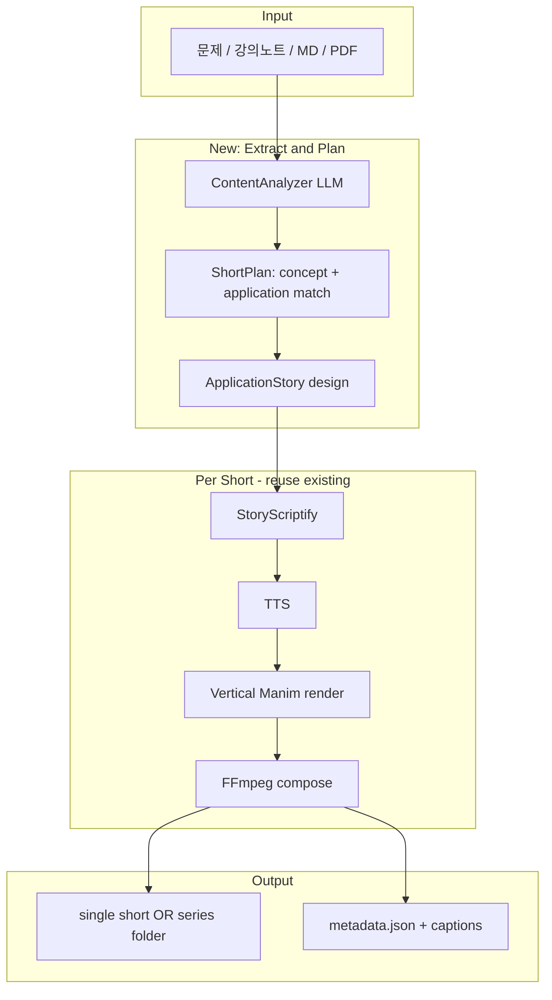
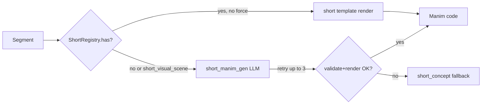
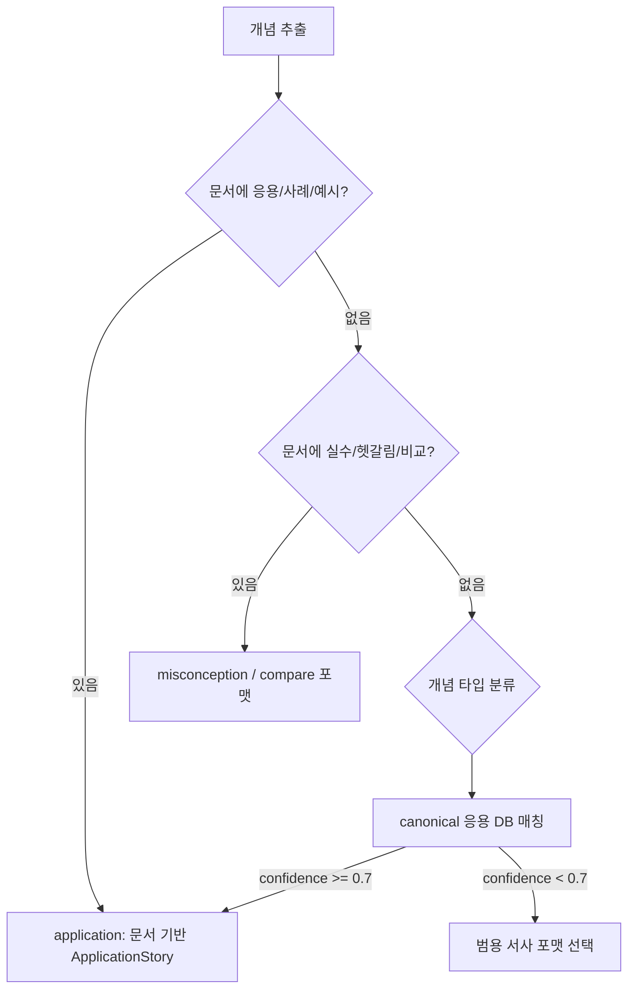

## Grill-me 결정 사항 (확정)

| # | 주제 | 결정 |
|---|------|------|
| 1 | MVP 우선순위 | **B** Extract→Story→단일 쇼츠 E2E (레이아웃 best-effort) |
| 2 | 코드 구조 | **A** 별도 `short_orchestrator`, TTS/Manim/composer만 공유 |
| 3 | single unit 선택 | **D** 항상 Extract→plan.json; 기본 #1, `--topic` fuzzy match |
| 4 | headline 구현 | **A** ASS Headline 스타일, final burn-in (Manim mixin X) |
| 5 | StoryFormat MVP | **A** 5종 Extract/StoryScriptify; visual은 **쇼츠 전용 템플릿 다수 + `short_visual_scene` LLM fallback** (long-form과 동일 패턴) |
| 6 | 길이 정책 | **B** 소프트 60초 — 초과해도 출력, metadata warning |
| 7 | beat↔segment | **B** 3~5 segment; Hook·Concept·Payoff 필수, Problem+Application 병합 가능 |
| 8 | canonical DB | **D** seed ~20 + confidence<0.6 → misconception/curiosity 강제 |
| 9 | plan 검토 | **B** 기본 자동 렌더; `--dry-run` / `--plan-only` 지원 |
| 10 | BGM | **C** 쇼츠 preset 1~2 bundled, **기본 on** |
| 11 | series MVP | **D** single E2E 직후 series (`--max-shorts`) 같은 wave |
| 12 | tone | **D** story_format→tone 고정 매핑, CLI 옵션 없음 |
| 13 | 입력 MVP | **A** .md / plain text만 |
| 14 | payoff visual | **D** `application`만 `short_before`→`short_after` 순차; 나머지 `short_payoff_card` |
| 15 | LLM 모델 | **C** Extract=`MODEL_EXTRACT`(strong), StoryScriptify=`MODEL_SCRIPT` |
| 16 | 소셜 metadata | **B** hashtags 3~5 + 1줄 description |
| 17 | Extract 0 unit | **D** min 1 prompt + validate + 1 retry → fail + plan status |
| 18 | series 순서 | **B** prerequisites topological sort, cycle→LLM order fallback |
| 19 | series cohesion | **A** unit마다 도메인·format **독립** (다양성 우선) |
| 20 | before/after | **A** 순차 (before segment → after segment), 2-panel X |
| 21 | CLI | **D** `short` subcommand, 기존 long-form 경로 유지 |

### story_format → tone 매핑 (확정)

| format | tone |
|--------|------|
| application | casual |
| misconception | dramatic |
| stakes | dramatic |
| curiosity | insider |
| pattern | casual |

### MVP E2E 흐름 (확정)

```
입력(.md/text)
  → Extract (MODEL_EXTRACT) → ShortSeriesPlan + plan.json
  → [--dry-run] stop
  → single: pick unit (#1 or --topic match)
  → series: topological sort → max_shorts cap
  → per unit: StoryScriptify (MODEL_SCRIPT) → TTS → Manim (3~5 seg) → compose
  → ASS headline + subtitle burn-in → final.mp4 + metadata (hashtags, description)
```

---

# STEM 쇼츠/릴스 생성 기능 기획

## 제품 한 줄 정의

**"긴 강의·노트·문제를 넣으면, 학습 가치가 있는 '한 입 크기' 지식 단위로 쪼개고, 각각을 15~60초 세로 영상으로 자동 제작한다."**

사용자가 생각하신 흐름은 **"입력 → 개념 추출 → (그 개념이 실제로 쓰이는 맥락을 스토리로 풀어) 영상화 → '이렇게 응용하면 이런 결과'로 마무리"** 입니다. 퀴즈·밈 같은 가벼운 재미가 아니라, **응용 사례 중심의 미니 내러티브**가 쇼츠의 뼈대입니다.

예: 문서에 "노이즈 함수" 개념이 나온다 → Extract 단계에서 "게임 지형 생성" 응용을 매칭 → 쇼츠는 "무한 맵을 어떻게 만드나?"로 시작 → 노이즈 개념을 스토리로 소개 → 마지막에 "이 원리를 지형에 쓰면 → 이런 지형이 나온다"로 연결.

기존 [`orchestrator.py`](../src/manim_video_gen/pipeline/orchestrator.py)는 **하나의 긴 해설 영상**에 최적화되어 있으므로, 쇼츠는 **앞단에 "분해·기획·응용 스토리 설계" 레이어**를 새로 두는 것이 핵심입니다.



---

## 1. 콘텐츠 모델: "지식 단위(ShortUnit)"

기존 [`SolutionPlan`](../src/manim_video_gen/models/solution.py) + [`VideoScript`](../src/manim_video_gen/models/script.py)는 **한 영상의 연속 서사**를 가정합니다. 쇼츠용으로는 중간 모델을 새로 둡니다.

```python
# 제안: models/short.py
class ApplicationStory(BaseModel):
    """개념을 '실제 쓰임' 맥락으로 풀어주는 미니 내러티브."""
    domain: str                   # LLM이 자유 선택 (game_dev, medicine, finance, ...)
    domain_label: str             # UI 표시용 자연어: "게임 개발", "임상시험"
    scenario: str                 # "오픈월드 게임에서 무한 지형을 만들 때"
    problem_in_domain: str
    concept_bridge: str
    application_result: str
    result_visual: str
    payoff_line: str

class ShortUnit(BaseModel):
    id: str
    headline: str                 # 상단 고정 제목 (전체 영상 내내 표시)
    # 예: "게임에서 지형을 만들 때 쓰는 특수한 수학 기법"
    # 예: "게임 애니메이션을 만드는 수학"
    concept_name: str             # 문서에서 추출한 핵심 개념 (본문에서 delayed reveal)
    core_insight: str
    story: ApplicationStory
    explanation: str
    visual_concept: str
    result_visual_concept: str
    visual_type: str
    difficulty: Literal["easy","medium","hard"]
    prerequisites: list[str]
    estimated_seconds: int
```

**추출 기준 (LLM 프롬프트에 명시):**
- 하나의 ShortUnit = **독립적으로 이해 가능** + **30~45초로 설명 가능**
- **반드시 `ApplicationStory` 포함** — 개념만 나열하는 unit은 drop 또는 재생성
- **응용 도메인은 LLM이 자유롭게 선택** — 문서에 언급되면 참고하되, 없어도 LLM이 가장 설득력 있는 도메인·서사를 스스로 고름 (사용자 `--domain` 지정 없음)
- **`headline` 필수** — Extract 단계에서 응용 맥락을 반영한 **매력적인 상단 제목** 생성
- 시각화 2 beat: (1) 개념 설명 visual, (2) 응용 결과 visual (before→after)

[`problem2.md`](../problem2.md) 예시 — **응용 스토리텔링 관점:**

| Short | 시나리오 (Hook) | 개념 | Payoff (응용 결과) |
|-------|-----------------|------|-------------------|
| 1 | "신약 효과, 우연일까?" | p-value | "임상시험에서 p<0.05 → '우연이 아니다'고 FDA 승인 판단" |
| 2 | "100번 실험 중 5번은?" | 유의수준 α | "α=5%는 '억울한 기각'을 감수하는 정책선" |
| 3 | "약이 진짜인데 못 잡는다?" | 검정력 | "표본 크기 키우면 → 희미한 효과도 잡아내는 A/B 테스트" |

게임 지형 예시 (문서에 노이즈/함수 개념이 있을 때):

| Beat | 나레이션 | 화면 |
|------|----------|------|
| Hook | "마인크래프트 맵, 어떻게 무한히 만들까?" | 게임 지형 실루엣 |
| Problem | "랜덤이면 지옥, 손으로 그리면 불가능" | before: 노이즈 난장판 |
| Concept | "부드럽게 변하는 값 → Perlin noise" | 수식/그래프 1개 |
| Payoff | "이걸 높이에 쓰면 → 자연스러운 산" | after: terrain |

[`problem.md`](../problem.md) 예시: (a)(b)(c)를 **3개 쇼츠** 또는 **1개 통합 쇼츠**로 선택 가능.

---

## 2. 파이프라인 4단계 (기존 대비 변경점)

### Stage A — Extract (신규)
- **입력:** MD/텍스트 (1차), PDF는 2차
- **출력:** `ShortSeriesPlan { title, units[], recommended_order[] }`
- **파일:** `llm/prompts/extract_shorts.py`, `pipeline/short_extractor.py`
- **모델:** `MANIM_VIDEO_GEN_MODEL_EXTRACT` (새 env, 기본은 script 모델 재사용 가능)

추출 후 **로컬 필터** (LLM 없이):
- `estimated_seconds > 60` → 분할 제안 또는 drop
- `visual_type`이 템플릿 미지원 + 복잡도 높음 → downgrade 또는 `visual_scene` 플래그
- 시리즈 모드: `prerequisites` 기반 topological sort

### Stage B — StoryScriptify (기존 scriptify 파생)
- **입력:** `ShortUnit` (concept + `ApplicationStory`)
- **출력:** `VideoScript` (세그먼트 **3~5개**, 응용 스토리 아크 고정)
- **구조 템플릿 (고정 — 사용자 의도 반영):**

```
[Hook 0~3s]        → ApplicationStory.scenario ("게임 지형, 어떻게 무한히?")
[Problem 3~10s]    → ApplicationStory.problem_in_domain + before visual
[Concept 10~25s]   → 개념 소개 (수식/그래프), story.concept_bridge로 연결
[Application 5~15s]→ ApplicationStory.application_result + after visual
[Payoff 3~5s]      → story.payoff_line ("이게 바로 ○○의 응용이다") + CTA
```

**핵심:** 개념 설명이 **먼저** 나오는 강의형이 아니라, **응용 맥락(스토리) 안에서** 개념이 "필요한 도구"로 등장해야 함.

기존 [`scriptify.py`](../src/manim_video_gen/llm/prompts/scriptify.py)의 `intro_problem`/`outro_summary`를 쇼츠용 **story arc**로 대체. `talking-ver` 브랜치의 대화형 톤과도 궁합 좋음.

### Stage C — Vertical Render (기존 렌더 확장)
현재 [`config.py`](../src/manim_video_gen/config.py)의 `VIDEO_WIDTH/HEIGHT`만으로는 부족합니다.

**필수 변경:**
| 컴포넌트 | 현재 | 쇼츠 |
|----------|------|------|
| 해상도 | 16:9 기본 | **1080×1920 (9:16)** preset |
| ASS 자막 | PlayRes 1920×1080 고정 [`subtitle.py`](../src/manim_video_gen/video/subtitle.py) | PlayRes를 출력 해상도에 연동 |
| Manim 템플릿 | 가로 중앙 배치 | **vertical safe zone** + **상단 headline 고정 영역** |
| 폰트/수식 | 기본 크기 | **1.3~1.5× scale**, 최대 2줄 수식 |
| 세그먼트 수 | 10~30+ | **3~5** |
| 상단 제목 | 없음 | **`headline` 전 구간 고정 오버레이** (상단 중앙) |

**접근:** `VideoFormatProfile` enum 추가 (`landscape` | `short_9_16`). short_orchestrator는 **쇼츠 전용 TemplateRegistry** 사용.

### 쇼츠 visual: 템플릿 레지스트리 + LLM fallback (long-form과 동일 패턴)

long-form [`orchestrator.py`](../src/manim_video_gen/pipeline/orchestrator.py)의 `_build_manim_code_for_segment`와 **같은 3단 분기**:

```
1. ShortTemplateRegistry.has(visual_type) → 쇼츠 전용 템플릿 렌더
2. 없거나 / 템플릿 한계 / StoryScriptify가 short_visual_scene 지정 → LLM Manim gen (retry 3회)
3. LLM 실패 → 최소 fallback 템플릿 (short_payoff_card 또는 short_concept)
```

long-form의 `visual_scene` ↔ 쇼츠의 **`short_visual_scene`**. registry에 등록되지 않으며, LLM이 9:16 세로 Scene 코드를 직접 생성.



**long-form과 공유:** `code_validator`, smoke render, retry with prior failure context, `duration_adjuster`, `composer.merge_segment`.

**long-form과 분리:** `ShortTemplateRegistry`, `short_manim_gen.py` 프롬프트(9:16 safe zone, beat 힌트), fallback 대상 템플릿.

---

### 쇼츠 전용 visual_type 카탈로그 (미리 구현)

StoryScriptify는 **아래 등록된 타입을 우선** 사용. 표현이 부족할 때만 `short_visual_scene`.

#### Beat / 서사용 (기본)

| visual_type | 역할 |
|-------------|------|
| `short_hook` | Hook — 질문 텍스트 + 간단 아이콘/실루엣 |
| `short_before` | application Problem — before 상태 |
| `short_after` | application Payoff — after 결과 (순차) |
| `short_payoff_card` | non-application Payoff — 한 줄 결론 + highlight |
| `short_cta` | 선택 — "Part 2" / 시리즈 연결 |

#### 개념 설명용 (Concept beat)

| visual_type | 역할 |
|-------------|------|
| `short_concept_equation` | 세로 중앙, 수식 1~2줄 크게 |
| `short_concept_graph` | 세로 axes, 곡선/점 1 focal |
| `short_concept_number_line` | 수직선·구간·점 |
| `short_concept_annotated` | 수식 + brace 주석 1개 |
| `short_concept_compare` | misconception — 틀린 vs 맞는 2줄 |
| `short_concept_pattern` | pattern format — 사례 3개 → 화살표 → 개념 |

#### 응용 / 연출 다양성

| visual_type | 역할 |
|-------------|------|
| `short_domain_icon` | domain 분위기 (게임/의료/금융 실루엣) |
| `short_stat_chart` | 막대/분포 간단 chart (p-value, α 등) |
| `short_flow_arrow` | 절차 2~3 step 화살표 (stakes, curiosity) |

#### LLM 전용

| visual_type | 역할 |
|-------------|------|
| `short_visual_scene` | registry 미등록 연출 — 지형 mesh, A/B UI, custom diagram 등 |

**MVP 구현 우선순위:** beat 5종 + concept 4종(`equation/graph/number_line/annotated`) + `short_visual_scene` LLM path. 나머지는 Phase 2에서 registry에 추가.

---

### StoryScriptify visual 선택 규칙

long-form [`scriptify.py`](../src/manim_video_gen/llm/prompts/scriptify.py)와 동일 철학:

1. **등록된 short visual_type 우선** — 안정·빠름·일관 레이아웃
2. **`short_visual_scene`** — 아래일 때만:
   - 응용 결과가 템플릿으로 표현 어려울 때 (게임 지형, 3D 느낌 mesh, 복잡 diagram)
   - domain-specific 연출이 스토리 핵심일 때
   - `visual_description`이 기존 short template param으로 담기지 않을 때
3. **남용 금지** — unit당 `short_visual_scene` **최대 1 segment** (기본). Concept는 template, Payoff/Before/After 중 1곳만 LLM 허용 권장
4. **`short_visual_scene` 지정 시** `visual_params.scene_brief` + `beat` + `domain` 필수 — short_manim_gen 입력

**story_format별 기본 매핑 (LLM은 override 가능):**

| format | Problem | Concept | Payoff |
|--------|---------|---------|--------|
| application | `short_before` | `short_concept_*` | `short_after` (또는 LLM 지형) |
| misconception | `short_hook` | `short_concept_compare` | `short_payoff_card` |
| stakes | `short_hook` | `short_concept_equation` | `short_payoff_card` |
| curiosity | `short_hook` | `short_concept_graph` | `short_payoff_card` |
| pattern | `short_hook` | `short_concept_pattern` | `short_payoff_card` |

Concept 서브타입(`equation`/`graph`/…)은 StoryScriptify가 개념 성격에 맞게 선택.

---

### short_manim_gen (LLM Manim)

long-form [`manim_gen.py`](../src/manim_video_gen/llm/prompts/manim_gen.py) 파생, 차이점:

- **Frame:** 9:16, headline 영역(상단 12%)·subtitle 영역(하단 20%) **침범 금지**
- **Pacing:** segment duration 짧음 — animation 2~4개 이내
- **입력:** `visual_description`, `beat`, `domain`, `story_format`, `ApplicationStory` 요약
- **few-shot:** 세로 hook / before-after terrain / simple stat chart 예시 포함
- **retry:** 실패 시 prior code + error를 다음 attempt에 전달 (long-form 006 post-mortem 패턴)
- **fallback:** 3회 실패 → `short_concept_equation` 또는 `short_payoff_card`로 degrade

---

### 기존 long-form 템플릿과의 관계

- long-form `TemplateRegistry` / `equation_write` / `graph_plot` 등 **경로 안 탐**
- orchestrator **패턴**(registry → LLM → fallback)만 재사용
- `short_concept_graph` 등 **내부 Manim 코드**는 long-form GraphPlot **참고 가능**하되, 9:16 layout은 short 파일에 독립 구현

headline은 Manim 템플릿이 아닌 **ASS overlay**(Grill-me #4 확정).

### Stage C-2 — 상단 Headline 오버레이 (신규)

Extract 단계에서 생성한 `ShortUnit.headline`을 **영상 전체 구간 동안 상단 중앙에 고정 표시**.

**레이아웃 (1080×1920 기준):**
```
┌─────────────────────────┐
│  [headline 영역 ~12%]   │  ← "게임에서 지형을 만들 때 쓰는 특수한 수학 기법"
│      (상단 중앙)         │
├─────────────────────────┤
│                         │
│   [main visual ~58%]    │  ← 수식/그래프/before-after
│                         │
├─────────────────────────┤
│  [subtitle 영역 ~20%]   │  ← narration 자막
│  [safe margin ~10%]     │
└─────────────────────────┘
```

**headline 작성 규칙 (Extract LLM):**
- 패턴: `{응용 맥락} + {수학/개념}` 또는 `{도메인}을 만드는 {과목}`
- 좋은 예: "게임 애니메이션을 만드는 수학", "게임에서 지형을 만들 때 쓰는 특수한 수학 기법", "신약 승인을 가르는 통계"
- 나쁜 예: "Perlin Noise란?", "Chapter 3: Hypothesis Testing" (강의/교과서 톤)
- 2줄 이내, 각 줄 15자 내외 권장
- `concept_name`은 headline에 넣지 않음 (delayed labeling 유지)

**구현:**
- Manim: 모든 쇼츠 Scene에 `short_headline_overlay` mixin — `Text(headline)` at `UP * 3.2`, font_size 28~32, bold
- FFmpeg compose: 또는 ASS `Dialogue` style `Headline` — 상단 중앙, MarginV 큼, **전 세그먼트 duration 동안 1개 이벤트**
- headline은 TTS로 읽지 않음 (visual-only). 첫 Hook 나레이션과 중복 방지.


### Stage D — Compose & Package (기존 composer 확장)
- 단일 모드: `artifacts/short_<id>/final.mp4`
- 시리즈 모드: `artifacts/series_<run_id>/short_01.mp4 ... short_N.mp4`
- **`series_metadata.json`:** title, hook, hashtags, duration, thumbnail_frame_sec
- 선택: **일관 intro 0.5s** (시리즈 브랜딩), **outro CTA** ("Part 2 →")

---

## 3. 응용 스토리텔링 설계 (Application Story Layer)

사용자가 말한 "재미/포인트"는 **퀴즈·밈이 아니라, 개념이 실제로 쓰이는 맥락을 따라가는 미니 스토리**입니다.

### Extract 단계에서 하는 일
1. 문서에서 **학습 가치 있는 개념** 추출
2. LLM이 각 개념에 **가장 매력적인 응용 도메인·서사 포맷을 자유롭게 선택** (문서 힌트 > canonical DB > synthesized)
3. **`headline` 생성** — 응용 맥락을 담은 상단 제목 (아래 §4 참조)
4. `ApplicationStory` 5요소 작성: scenario → problem → concept_bridge → application_result → payoff_line

**도메인 선택 정책:** 사용자 입력·CLI 옵션으로 도메인을 고정하지 않음. LLM이 개념마다 최적 도메인을 고르고, `domain` + `domain_label` + `confidence`를 메타데이터로 기록.

### StoryScriptify에서 하는 일
- 나레이션을 **3인칭 강의**가 아닌 **"문제 상황 → 왜 이 개념이 필요한지 → 써보면 이렇게 된다"** 흐름으로 작성
- **`narration` / `tts_text` 모두 스토리텔링 톤으로 변형** (아래 §4.5 참조) — 기존 [`scriptify.py`](../src/manim_video_gen/llm/prompts/scriptify.py)의 교사형 대본 규칙을 쇼츠용으로 교체
- `concept_bridge` 문장이 Concept 세그먼트 직전에 반드시 등장 ("그래서 ○○가 필요하다")
- `payoff_line`이 마지막 세그먼트에서 반드시 등장 ("이게 바로 ○○의 응용이다")

### 렌더링
- **기본:** `ShortTemplateRegistry`에 등록된 visual_type → 세로 전용 Manim 코드 생성
- **창의적/복잡 연출:** `short_visual_scene` → `short_manim_gen` LLM (retry 3회)
- **실패 fallback:** `short_concept_equation` 또는 beat에 맞는 최소 템플릿
- application before/after: `short_before` → `short_after` 순차; 지형 등은 after beat를 `short_visual_scene`으로 LLM 허용

### 품질 가드 (`short_quality` 프로파일)
- `ApplicationStory` 5필드 모두 non-empty
- Concept 세그먼트 **앞에** Problem 세그먼트 존재 (강의형 역순 방지)
- Payoff 세그먼트에 `application_result` 키워드 포함
- hook이 개념명이 아닌 **시나리오/질문**으로 시작하는지 검사

---

## 3.5. 입력에 스토리가 없을 때 — Fallback Narrative Strategy

문서에 게임 지형 같은 **구체적 응용 사례가 없는 경우가 대부분**입니다. 이때 "억지로 게임 dev 스토리를 붙이기"보다, **개념 성격에 맞는 서사 포맷을 자동 선택**하는 것이 낫습니다.

### 원칙: "공부한다"는 느낌을 줄이는 4가지 장치

| 장치 | 설명 | 왜 먹히는가 |
|------|------|-------------|
| **Delayed Labeling** | 개념 이름을 10~15초 뒤에 공개 | 정의부터 들으면 '강의 모드' ON |
| **Tension First** | "맞을까? 틀릴까?" "뭐가 문제?"로 시작 | 호기심 gap → 스와이프 방지 |
| **Second Person** | "너라면?" "이 데이터 보면?" | 관찰자가 아닌 참여자 |
| **Tangible Payoff** | 수식 대신 before/after, 한 줄 결론 | '배웠다'보다 '알겠다' 느낌 |

### Story Source 우선순위 (Extract 단계)



1. **문서 내 사례** — 예시, citation, "예:", 실습 문제 → 그대로 확장
2. **문서 내 tension** — "흔한 실수", "주의", "헷갈리는 점" → Misconception 포맷
3. **Canonical 응용 DB** — 개념명→대표 응용 매핑 (p-value→임상시험, gradient→경사하강 등)
4. **범용 서사 포맷** — 아래 5종 중 LLM이 개념에 맞게 1개 선택

### 5가지 Fallback 서사 포맷 (`StoryFormat`)

입력에 스토리가 없을 때 쓰는 **대체 내러티브 템플릿**. ApplicationStory와 동일한 5 beat 구조를 유지하되, `story_format` 필드로 구분.

| format | Hook 예시 | 흐름 | 적합한 개념 |
|--------|-----------|------|-------------|
| **`application`** (기본) | "게임 지형, 어떻게?" | 시나리오→문제→개념→응용결과 | 응용 명확 (노이즈, 회귀, 최적화) |
| **`misconception`** | "90%가 여기서 틀린다" | 흔한 오해→왜 틀리는지→올바른 직관 | H0/H1, p-value, 상관≠인과 |
| **`stakes`** | "이걸 모르면 100만 원?" | 결정 상황→잘못 판단→개념→올바른 판단 | 예산선, α, 리스크 |
| **`curiosity`** | "왜 Netflix 썸네일이 바뀌지?" | 관찰→질문→개념→"아, 그래서!" | A/B, 검정, 확률 |
| **`pattern`** | "이 3개, 공통점?" | 사례 3개→패턴 발견→개념 이름 | 분포, 함수 family, 정리 |

**추천:** Extract LLM이 개념마다 `story_format` + `confidence`를 함께 출력. `confidence < 0.6`이면 `misconception` 또는 `curiosity`로 fallback (억지 응용보다 안전).

### 모델 확장

```python
class StoryFormat(str, Enum):
    application = "application"       # 문서/DB 기반 실제 응용
    misconception = "misconception"   # 흔한 실수 깨기
    stakes = "stakes"                 # 결정·손실 맥락
    curiosity = "curiosity"           # 호기심 질문
    pattern = "pattern"               # 패턴 발견형

class ApplicationStory(BaseModel):
    story_format: StoryFormat
    confidence: float                 # 0~1, 응용/서사 매칭 확신도
    source: Literal["document", "canonical_db", "synthesized"]
    # ... 기존 필드 동일
```

### Canonical 응용 DB (Phase 2~3)

하드코딩 JSON 또는 LLM 1회 배치로 구축. 예:

```json
{
  "p-value": { "domain": "medicine", "scenario": "신약이 진짜 효과 있을까?", "confidence": 0.9 },
  "budget_constraint": { "domain": "everyday", "scenario": "월급으로 뭐 살 수 있을까?", "confidence": 0.85 },
  "perlin_noise": { "domain": "game_dev", "scenario": "무한 게임 맵 만들기", "confidence": 0.95 }
}
```

문서에 없어도 **well-known 응용**은 DB에서 가져오되, `source: "canonical_db"`로 메타데이터에 표시.

### "재미" vs "몰래 학습" — 톤 가이드 (StoryScriptify)

**피해야 할 것:**
- "오늘은 ○○에 대해 배워보겠습니다"
- 첫 3초에 기호/정의 (H0, p-value 정의...)
- 60초 내내 같은 톤

**권장:**
- Hook은 **질문·상황·반전**만 (개념명 X)
- Concept beat에서야 처음 기호 등장
- Payoff는 **한 문장 + visual** ("그래서 FDA는 p<0.05를 본다")
- `--tone` 옵션: `casual`(친구 설명) | `dramatic`(긴장) | `insider`("아는 사람만") — 기본 `casual`

### problem2.md (가설검정) — 스토리 없을 때 예시

문서에 게임 dev 같은 응용은 없음 → format 자동 선택:

| 개념 | 선택 format | Hook |
|------|---------------|------|
| p-value | `curiosity` | "新薬 광고, '통계적으로 유의'… 그게 뭔데?" |
| α (유의수준) | `misconception` | "5%면 95% 확실? **아님**" |
| 검정력 | `stakes` | "약이 진짜인데 못 잡으면?" |
| t-검정 | `pattern` | "이 3개 실험, 뭐가 같을까?" |

### 사용자 옵션 (최소화)

```bash
# LLM이 도메인·서사·headline·대본 톤 모두 자동 결정 (기본)
python -m manim_video_gen short -f doc.md --mode series
```

도메인·서사 포맷·톤은 **LLM 자유 선택**. 개발/디버그용으로만 `--story-format` override 가능.

---

## 4.5. TTS·자막 스토리텔링 변형 (Short Narration Layer)

기존 파이프라인은 [`Segment.narration`](../src/manim_video_gen/models/script.py)(자막)과 `tts_text`(TTS 발음)를 분리합니다. 쇼츠에서는 **둘 다 강의 톤이 아닌 스토리텔링 톤**으로 생성해야 합니다.

### 기존(강의) vs 쇼츠(스토리) 대비

| | 기존 scriptify | short scriptify |
|--|----------------|-----------------|
| 톤 | "구해봅시다", "정리하면" | "만약 네가 맵을 만든다면?", "그래서 개발자들은 이렇게 한다" |
| 시작 | 문제/정의 | 상황·질문·반전 |
| 수식 등장 | 초반부터 | Concept beat 이후 |
| headline | 없음 | TTS에 읽지 않음 (화면 전용) |

### narration (자막) 규칙
- **짧은 문장** (한 자막 12~18자, 최대 2줄)
- **구어체** — "~입니다" 남발 X, "~거든", "~지?", "근데" 허용
- **스토리 1인칭/2인칭** — "너", "개발자들", "연구팀"
- 수식은 Unicode plain (기존 scriptify 규칙 유지)
- headline 내용을 narration에 반복하지 않음

### tts_text (TTS) 규칙
- narration과 **같은 의미, TTS 최적화 발음** (기존 phonetic 규칙 유지)
- 강의체 어미 변환: "구해봅시다" → "한번 볼까?", "정의하면" → "쉽게 말하면"
- **속도감:** 문장 길이 짧게, 쉼표로 리듬
- headline은 tts_text에 포함하지 않음

### 세그먼트별 narration/tts 예시 (게임 지형)

| Beat | narration (자막) | tts_text |
|------|------------------|----------|
| Hook | 무한 맵, 어떻게 만들까? | 무한 맵, 어떻게 만들까? |
| Problem | 랜덤이면 난장판이야 | 랜덤이면 난장판이야 |
| Concept | 부드럽게 변하는 값이 필요해.\nPerlin noise. | 부드럽게 변하는 값이 필요해. 퍼린 노이즈. |
| Payoff | 높이에 쓰면 이런 산이 나와 | 높이에 쓰면 이런 산이 나와 |

### StoryScriptify 프롬프트 추가 지시
- `VideoScript.title` = `ShortUnit.headline` (메타용, 화면 headline과 동일)
- 각 segment에 `beat: hook|problem|concept|application|payoff` 태그
- `_ensure_tts_text()` 쇼츠용 후처리: 강의체 패턴 감지 시 구어체로 치환

### 품질 가드 (narration)
- "오늘은", "배워보", "정리하면", "구해봅시다" 등 강의 패턴 → soft fail → 재생성
- 첫 segment narration에 `concept_name` 포함 시 → fail (delayed labeling 위반)

---

## 4. CLI / API 설계

```bash
# 단일 쇼츠 (핵심 1포인트만)
python -m manim_video_gen short -f problem2.md --mode single --topic "p-value란?"

# 시리즈 (자동 분해)
python -m manim_video_gen short -f problem2.md --mode series --max-shorts 5

# 특정 unit만 재렌더
python -m manim_video_gen short --from-plan artifacts/series_xxx/plan.json --unit 2
```

프로그래매틱:
```python
from manim_video_gen.pipeline import generate_short, generate_short_series

generate_short(content, topic="...", format="short_9_16")
generate_short_series(content, max_units=5, on_progress=...)
```

---

## 5. 구현 로드맵 (권장 순서)

### Phase 0 — Vertical Foundation (1~2주)
**목표:** 기존 문제 1개를 9:16로 렌더해도 안 깨짐

- `VideoFormatProfile` + 1080×1920 preset
- [`subtitle.py`](../src/manim_video_gen/video/subtitle.py) PlayRes 동적화
- Manim `--resolution` + vertical safe area
- 회귀 테스트 1개 (가로 vs 세로 동일 script)

### Phase 1 — Single Short MVP (1~2주)
**목표:** `--mode single`로 "한 포인트" 쇼츠 1개 생성

- `ShortUnit` 수동 입력 또는 `--topic`으로 extract 1개
- `short_scriptify` 프롬프트 + 2~4 segment 제한
- hook/punchline segment type
- 출력 15~60초 검증

### Phase 2 — Series Extract (1~2주)
**목표:** MD 입력 → N개 ShortUnit → 배치 렌더

- `extract_shorts.py` 프롬프트
- prerequisite 기반 ordering
- `generate_short_series()` orchestrator
- `series_metadata.json`

### Phase 3 — Application Story + Quality (1~2주)
- `ApplicationStory` 추출 프롬프트 (개념↔응용 매칭)
- StoryScriptify story arc 강제
- before/after 페이오프 visual (`before_after` 템플릿 또는 visual_scene)
- short_quality 가드 (story arc 검증)

### Phase 4 — Polish (선택)
- PDF 입력 (pymupdf / unstructured)
- 썸네일 자동 추출 (ffmpeg `-ss`)
- BGM preset (쇼츠용 짧은 loop, 기존 [`composer.py`](../src/manim_video_gen/video/composer.py) BGM 재사용)
- `origin/feat/talking-ver` 브랜치의 대화형 톤과 병합 검토

---

## 6. 기존 코드 재사용 vs 신규

**그대로 재사용 (~70%):**
- TTS factory, OpenRouter client, Manim renderer, composer, diagnostics
- visual_type 템플릿 + LLM manim_gen fallback
- consistency_validator (쇼츠용 규칙 추가)

**신규 (~30%):**
- `models/short.py`, `pipeline/short_extractor.py`, `pipeline/short_orchestrator.py`
- `llm/prompts/extract_shorts.py`, `llm/prompts/short_scriptify.py`, `llm/prompts/short_manim_gen.py`
- `video/templates/short/` (10+ templates) + `short_registry.py`
- short_orchestrator 내 `_build_short_manim_code_for_segment` (long-form `_build_manim_code_for_segment` 미러)
- vertical ASS headline/subtitle
- CLI `short` subcommand

**long-form 전용 (쇼츠에서 사용 안 함):**
- `equation_chain`, `scene_bridge`, `intro_problem`, `outro_summary`, `equation_steps`, `equation_derivation`

---

## 7. 성공 기준 (Acceptance Criteria)

- [ ] `problem2.md` → 시리즈 3~5개, 각 15~60초, 9:16
- [ ] 각 쇼츠 상단 중앙에 `headline` 전 구간 고정 표시
- [ ] narration/tts_text가 스토리텔링 톤 (강의체 패턴 없음)
- [ ] headline은 TTS로 읽지 않음 (visual-only)
- [ ] 각 쇼츠가 ApplicationStory 아크를 따름 (시나리오→문제→개념→응용결과→payoff)
- [ ] 마지막 5초에 "이렇게 응용하면 이런 결과" 페이오프 존재
- [ ] ShortTemplateRegistry 템플릿 우선 렌더 + `short_visual_scene` LLM fallback 동작
- [ ] LLM 실패 시 short fallback 템플릿 degrade
- [ ] 세로 화면에서 수식·그래프·자막·headline 겹침 없음 (safe area)
- [ ] `--mode single --topic "..."` 으로 1개만 생성 가능
- [ ] 실패 unit만 `--unit N` 재렌더 가능

---

## 8. 리스크와 완화

| 리스크 | 완화 |
|--------|------|
| Extract가 너무 많이/적게 쪼갬 | `max_shorts`, `min_insight_score` 파라미터 |
| 세로에서 Manim 레이아웃 깨짐 | Phase 0에서 vertical template 전용 QA |
| 60초 초과 | TTS duration check → scriptify 재시도 (기존 quality loop 패턴) |
| LLM 비용 (N개 × full pipeline) | Extract 1회 + unit별 scriptify/render만; plan.json 캐시 |
| STEM 비수학(경제 표) | Phase 1은 graph/equation 위주, Phase 4에서 table/card template |

---

## 9. 차별화 아이디어 (선택)

기본 MVP 이후:

1. **Asset Injection:** 실제 게임 terrain 스크린샷/GIF를 Payoff beat에 삽입
2. **Series Arc:** LLM이 고른 같은 도메인으로 이어지는 "Part 1 → Part 2"
3. **Compare Payoff:** before(잘못된 적용) vs after(올바른 적용) split
4. **Visual-First:** 소리 꺼도 headline + before→after만으로 이해되게
