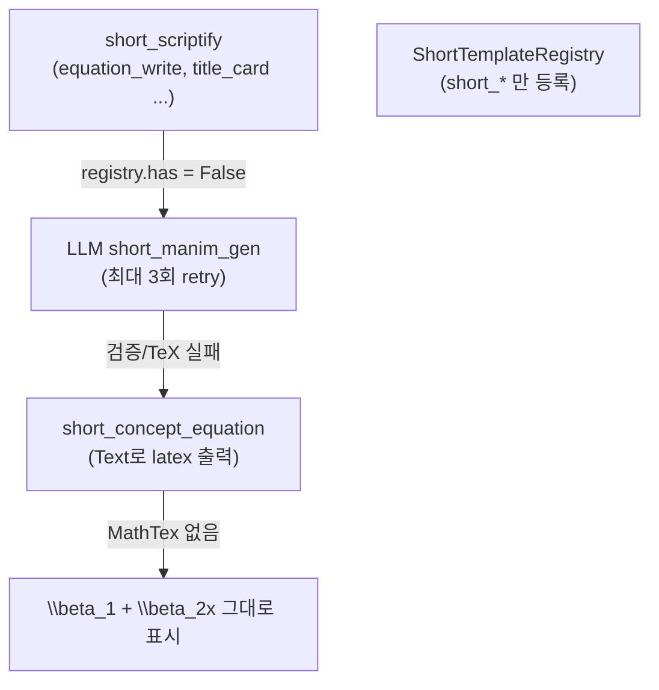
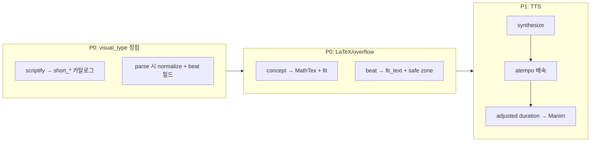

# Shorts 수식/템플릿/TTS 개선 Plan

> 관련 문서: [shorts_feature_planning.md](shorts_feature_planning.md)  
> 작성 배경: 쇼츠 E2E 구현 후 수식 렌더링·템플릿 단조로움·TTS 속도·headline 크기·quality guard 한국어 오탐 이슈 대응

## 구현 체크리스트

- [ ] **P0-A** `short_scriptify.py`: short_* visual_type 카탈로그 교체 + STORY_FORMAT_VISUAL_MAP 수정 + parse 시 normalize_short_visual_type 추가
- [ ] **P0-B** `models/script.py`: Segment에 beat 필드 추가
- [ ] **P0-C** `concept_templates.py`: MathTex + wrap_korean_text_runs + fit_tex_mobject_lines + safe zone (`_layout.py` 헬퍼)
- [ ] **P0-D** `beat_templates.py`: fit_text_mobject_lines + headline fallback
- [ ] **P0-E** `short_orchestrator`: registry 우선 / short_visual_scene만 LLM / polish_tts_text / fallback 매핑 확장
- [ ] **P0-F** `subtitle.py` + `config.py`: 쇼츠 headline 폰트/위치를 자막보다 확실히 크게 (format_profile 기반, env 설정 가능)
- [ ] **P1-A** `config` + `audio_speed.py` + short_orchestrator TTS 후 atempo 배속 + `.env.example` 문서화
- [ ] **P1-B** TTS `polish_tts_text` short pipeline 적용
- [ ] **P1-C** `short_quality` payoff 연결성: 한국어 조사/구두점 정규화 토큰화 (`utils/korean_text.py`)
- [ ] **테스트** test_short_templates, test_short_scriptify, audio_speed, headline ASS, KO payoff 케이스

---

## 증상 요약

| 증상 | 사용자 관찰 |
|------|------------|
| A | 대부분 세그먼트가 중앙 수식 1개짜리 화면 |
| B | 수식이 좌우로 잘림 (overflow) |
| C | `\beta_1 + \beta_2x`처럼 raw LaTeX 문자열 표시 |
| D | TTS 목소리가 느림 |
| E | 상단 제목(headline)이 너무 작아 자막과 구분 안 됨 |
| F | `short_quality` payoff 검사가 한국어에서 false positive (파이프라인 중단) |

---

## 근본 원인 분석

### 원인 1: scriptify가 long-form visual_type을 출력 → registry miss → LLM 실패 → equation fallback

기획 문서([shorts_feature_planning.md](shorts_feature_planning.md) L255–318)는 `short_hook`, `short_concept_equation` 등 **쇼츠 전용 타입**을 scriptify가 우선 사용하도록 정의했습니다.

그러나 실제 [short_scriptify.py](../src/manim_video_gen/llm/prompts/short_scriptify.py) L99–112는 long-form 카탈로그(`equation_write`, `graph_plot`, `title_card` …)만 안내합니다.



[short_orchestrator.py](../src/manim_video_gen/pipeline/short_orchestrator.py) L266–272: registry hit 시에만 템플릿 사용. miss 시 LLM 3회 시도 후 fallback.

[short_manim_gen.py](../src/manim_video_gen/llm/prompts/short_manim_gen.py) L215–221: fallback 매핑 키가 `"hook"`, `"before"` 등인데, scriptify는 `"title_card"`, `"equation_write"`를 출력 → **거의 항상 `short_concept_equation`으로 degrade**.

**결과:** Hook/Graph/Before 등 beat별 다양한 템플릿(14종)이 있어도, 실제 렌더는 `short_concept_equation` Text fallback이 지배적.

---

### 원인 2: `short_concept_equation`이 의도적으로 `Text()` 사용

[concept_templates.py](../src/manim_video_gen/video/templates/short/concept_templates.py) L33–43:

```python
# Use Text for better compatibility (no LaTeX dependency)
eq = Text({text_repr}, font_size={font_size})
```

long-form [equation.py](../src/manim_video_gen/video/templates/equation.py) L149–150은 `MathTex` + `wrap_korean_text_runs` + `fit_tex_mobject_lines`를 사용.

**결과:** `\beta_1`, `\frac{}{}` 등 LaTeX 명령어가 **렌더되지 않고** monospace Text로 그대로 출력.

테스트([test_short_templates.py](../tests/test_video/test_short_templates.py) L83)도 `"Text" in code`를 **정상으로 검증** → 잘못된 동작이 테스트로 고정됨.

`short_concept_annotated`도 동일하게 `Text()` 사용 (L134).

---

### 원인 3: 9:16 overflow 방지 로직 부재

long-form은 `fit_tex_mobject_lines("eq")`로 `scale_to_fit_width(config.frame_width - 1.2)` 적용.

short concept/beat 템플릿 전체에:

- `fit_tex_mobject_lines` / `fit_text_mobject_lines` **미적용**
- 기획 safe zone(상단 12% headline, 하단 20% subtitle) **미적용** — `move_to(ORIGIN)`만 사용
- `_render_short_segment`에서 `subtitle_safe_area_px=0` 하드코딩 (L403)

**결과:** 긴 수식(회귀식, 분수 등)이 10.80 Manim unit 좁은 프레임에서 좌우 잘림.

---

### 원인 4: `beat` 필드 유실 + `short_visual_scene` 미구현

scriptify JSON schema에 `beat`가 있으나 [Segment](../src/manim_video_gen/models/script.py) 모델에 필드 없음 → Pydantic이 **beat 정보를 버림**.

기획의 `short_visual_scene`(LLM 전용 1 segment)도 코드베이스에 **0건** — registry에도 orchestrator 분기에도 없음.

---

### 원인 5: TTS 후처리 누락

| 항목 | long-form | short |
|------|-----------|-------|
| `polish_tts_text()` | [orchestrator.py](../src/manim_video_gen/pipeline/orchestrator.py) L520–538 적용 | import만 있고 **미호출** |
| playback rate | 없음 (Inworld synthesis rate만) | 없음 |

short pipeline (L469–474): `tts.synthesize()` → `tts_result.duration_seconds`를 그대로 Manim duration에 사용. **배속 후처리 없음**.

---

### 원인 6: headline ASS 스타일이 자막과 거의 동일한 크기

[subtitle.py](../src/manim_video_gen/video/subtitle.py) L398–428:

- `_HEADLINE_FONT_SIZE = 48` **하드코딩** (설정/env 없음)
- 자막 기본값 `subtitle_font_size = 42` ([config.py](../src/manim_video_gen/config.py) L284–286)
- **48 vs 42 = 약 14% 차이** → 제목인데 자막과 시각적 위계가 없음
- 9:16(1080×1920)에서도 headline 크기·margin이 **format_profile과 무관**하게 landscape 기준 상수 사용

기획([shorts_feature_planning.md](shorts_feature_planning.md) L33)은 headline을 **전체 영상 내내 표시하는 상단 고정 제목**으로 정의 — 자막보다 확실히 큰 title tier가 필요.

---

### 원인 7: `short_quality` payoff 연결성 검사가 영어식 공백 split

[short_orchestrator.py](../src/manim_video_gen/pipeline/short_orchestrator.py) L103–111:

```python
app_words = set(story.application_result.lower().split())
payoff_words = set(story.payoff_line.lower().split())
overlap = app_words & payoff_words
if len(overlap) < 2:
    errors.append("payoff_line does not reference application_result (too disconnected)")
```

**문제점:**

- 한국어는 **공백 단위 ≠ 의미 단위** — 조사(은/는/이/가), 어미, 괄호·숫자 변형으로 동일 의미 토큰이 mismatch
- E2E 검증([tasks/phase-1-shorts/09-e2e-verification.md](../tasks/phase-1-shorts/09-e2e-verification.md) L88–91) 실패 사례:
  - `"p-value가"` ≠ `"p-value"`
  - `"0.014(1.4%)로"` ≠ `"0.014"`
- 의미상 payoff가 application_result를 잘 참조해도 **overlap < 2**로 `short_quality failed` → CLI가 `ValueError` raise → **렌더 자체가 중단**

**결과:** LLM이 올바른 한국어 스토리를 생성해도 quality guard가 차단.

---

## 개선 방향 (우선순위)



---

## 구현 Plan

### P0-A. scriptify visual_type 카탈로그 교정

**파일:** [short_scriptify.py](../src/manim_video_gen/llm/prompts/short_scriptify.py)

- L99–112 long-form 카탈로그를 기획 문서의 `short_*` 14종 + `short_visual_scene`으로 교체
- beat별 기본 visual_type 매핑 테이블 추가 (기획 L310–318)
- `STORY_FORMAT_VISUAL_MAP` 값도 `short_*`로 변경
- 각 visual_type별 `visual_params` 스키마 예시 추가

**parse_short_scriptify_response:**

- `normalize_short_visual_type(vt, beat, story_format)` 함수 추가
- long-form → short 매핑 (equation_write → short_concept_equation, graph_plot → short_concept_graph, …)
- `visual_params` 키 정규화: `title` → `headline`, `equation` → `latex`

---

### P0-B. Segment 모델에 `beat` 필드 추가

**파일:** [models/script.py](../src/manim_video_gen/models/script.py)

```python
beat: str | None = Field(default=None, description="hook|problem|concept|application|payoff")
```

---

### P0-C. concept 템플릿 MathTex + overflow + safe zone

**파일:** [concept_templates.py](../src/manim_video_gen/video/templates/short/concept_templates.py)

- `short_concept_equation`: MathTex + `wrap_korean_text_runs` + `fit_tex_mobject_lines` + safe zone y offset
- `short_concept_annotated`: MathTex(latex) + Text(annotation)
- compare/pattern: `fit_text_mobject_lines` + `arrange(DOWN)`

**신규:** [video/templates/short/_layout.py](../src/manim_video_gen/video/templates/short/_layout.py)

---

### P0-D. beat 템플릿 overflow + headline 파라미터

**파일:** [beat_templates.py](../src/manim_video_gen/video/templates/short/beat_templates.py)

- 모든 `Text()`에 `fit_text_mobject_lines` 적용
- `short_hook`: `visual_params.headline` 없을 때 narration 첫 줄 fallback

---

### P0-E. orchestrator 렌더 분기 정리

**파일:** [short_orchestrator.py](../src/manim_video_gen/pipeline/short_orchestrator.py)

```
1. visual_type normalize
2. if registry.has(vt) → template (LLM skip)
3. elif vt == "short_visual_scene" → LLM
4. else → beat/story_format 기반 nearest template
5. LLM 3회 실패 시 → resolve_short_fallback_template(beat, vt)
```

**파일:** [short_manim_gen.py](../src/manim_video_gen/llm/prompts/short_manim_gen.py) — fallback 매핑 확장

---

### P0-F. Headline(제목) 타이포그래피

| | 현재 | 목표 (9:16) |
|--|------|-------------|
| Headline font | 48px 고정 | **68px** (subtitle ~1.6×) |
| Subtitle font | 42px | 42px 유지 |
| Headline 위치 | MarginV=180 | height × 0.08 ≈ 154px |

**env:** `MANIM_VIDEO_GEN_HEADLINE_FONT_SIZE`, `MANIM_VIDEO_GEN_HEADLINE_MARGIN_V` (0=자동)

**파일:** [subtitle.py](../src/manim_video_gen/video/subtitle.py), [config.py](../src/manim_video_gen/config.py)

---

### P1-A. TTS 배속 환경변수 + 파이프라인

**흐름:** TTS 생성 → ffmpeg atempo 배속 → adjusted duration으로 Manim

**env:** `MANIM_VIDEO_GEN_TTS_PLAYBACK_RATE` (default 1.0, 범위 0.5–2.0)

**신규:** [video/audio_speed.py](../src/manim_video_gen/video/audio_speed.py)

---

### P1-B. TTS 텍스트 polish 적용

short pipeline scriptify 직후 `_ensure_tts_text(script, settings)` 호출 (long-form과 동일).

---

### P1-C. `short_quality` 한국어 payoff 연결성 검사 개선

**신규:** [utils/korean_text.py](../src/manim_video_gen/utils/korean_text.py)

- `extract_content_tokens()`: 조사 strip, 영문/숫자 토큰 추출, 불용어 제거
- `payoff_references_application()`: 정규화 토큰 overlap >= 1 + substring fallback

**테스트 케이스:**

| application_result | payoff_line | 기대 |
|-------------------|-------------|------|
| `p-value가 0.014(1.4%)로 유의미합니다` | `p-value 0.014로 유의미해요` | pass |
| `기울기로 추세를 판단할 수 있어요` | `오늘 날씨가 좋네요` | fail |

---

### P2. 부가 개선

| 항목 | 파일 | 내용 |
|------|------|------|
| subtitle safe area | short_orchestrator L403 | `settings.subtitle_safe_area_px` 사용 |
| series mode bug | short_orchestrator L610 | `project_root` import 누락 수정 |

---

## 변경 파일 요약

| 우선순위 | 파일 | 변경 |
|---------|------|------|
| P0 | `llm/prompts/short_scriptify.py` | short_* 카탈로그, normalize |
| P0 | `models/script.py` | beat 필드 |
| P0 | `video/templates/short/concept_templates.py` | MathTex + fit + safe zone |
| P0 | `video/templates/short/beat_templates.py` | fit_text |
| P0 | `video/templates/short/_layout.py` | layout helper (신규) |
| P0 | `llm/prompts/short_manim_gen.py` | fallback 매핑 확장 |
| P0 | `pipeline/short_orchestrator.py` | render 분기, polish_tts, TTS speed, headline |
| P0 | `video/subtitle.py`, `config.py` | headline format-aware |
| P1 | `video/audio_speed.py` | ffmpeg atempo (신규) |
| P1 | `utils/korean_text.py` | KO token 추출 (신규) |
| P1 | tests | MathTex, normalize, audio_speed, headline, payoff |

---

## 검증 Plan

1. **단위 테스트:** normalize, MathTex fit, atempo duration, KO payoff
2. **통합:**
   ```bash
   manim_video_gen short -f problem.md --dry-run
   MANIM_VIDEO_GEN_TTS_PLAYBACK_RATE=1.25 manim_video_gen short -f problem.md
   ```
3. **회귀:** registry 14종, long-form default rate 1.0

---

## 기대 결과

| Before | After |
|--------|-------|
| 대부분 `short_concept_equation` Text fallback | beat별 hook/graph/before/after/payoff 템플릿 |
| `\beta_1 + \beta_2x` literal | MathTex 렌더 + auto scale |
| 긴 수식 좌우 잘림 | scale_to_fit_width + safe zone |
| TTS 느림 | `MANIM_VIDEO_GEN_TTS_PLAYBACK_RATE`로 배속 |
| headline 48px ≈ 자막 42px | short 9:16 기본 68px bold |
| KO payoff false positive | 조사/숫자 정규화 토큰 overlap |
